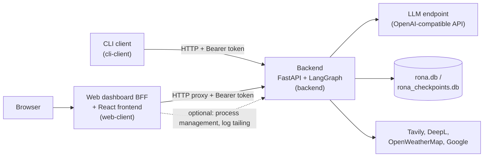

# Rona

**[Bu sayfayı Türkçe okuyun](README.md)**

Rona is a self-hosted personal AI assistant platform that connects to any OpenAI-API-compatible language model. It is not a single chat window — it is three independently deployable pieces: a **backend** (the agent core), a **CLI client**, and a **web dashboard** — and it ships with real capabilities: it can search the web, check the weather, translate text, manage your Google Calendar/Contacts/Gmail, remember things about you across conversations through semantic search, delegate long-running work to background subagents, and run scheduled tasks on its own even while you're offline.

## Table of Contents

- [Overview](#overview)
- [Features](#features)
- [Example Usage](#example-usage)
- [Project Structure](#project-structure)
- [Requirements](#requirements)
- [Installation & Running](#installation--running)
  - [Windows](#windows)
  - [macOS](#macos)
  - [Linux](#linux)
- [Configuration Reference](#configuration-reference)
- [Architecture](#architecture)
- [Testing](#testing)
- [Customizing Identity and Behavior](#customizing-identity-and-behavior)
- [Security Notes](#security-notes)
- [License](#license)

## Overview

Rona is an agent core built on **FastAPI** and a **LangGraph** state machine. Every incoming message is sent to a language model together with tool definitions; the model calls tools as needed, evaluates the results, and loops back for more tool calls when necessary. Sensitive actions (sending an email, deleting data, and similar) are never executed without an explicit, natural-language confirmation from the user first.

Outside the backend there are two independent clients: a dependency-free **CLI client**, and a **React-based web dashboard** that talks to the backend purely over HTTP and can be deployed on its own. All three components can run on the same machine or be spread across different ones.

## Features

### Chat and agent core
- One-shot (`/chat`) and streaming (`/chat/stream`, via Server-Sent Events) chat endpoints; in streaming mode, tool calls, progress steps, and intermediate state are pushed to the client live.
- Conversation history is persisted through LangGraph's SQLite-backed checkpointer, so a conversation resumes exactly where it left off even after a server restart. Idle conversations are cleaned up automatically after a configurable TTL.
- Two-tier model support: a fast, default **flash** tier and an optional **pro** tier for work that needs deeper reasoning. Both work with any OpenAI-API-compatible endpoint (OpenAI, OpenRouter, Azure OpenAI, a local vLLM/Ollama, etc.) and support custom request headers.

### Toolbox
22 core tools built into the backend (no install needed):

| Category | Tools |
|---|---|
| Web scraping | `web_scraper` |
| Local people records | `add_person`, `get_people`, `edit_person`, `delete_person`, `search_person` |
| Memory system | `add_memory`, `get_memories`, `edit_memory`, `delete_memory`, `search_memories` |
| Subagents | `start_subagent`, `list_subagents`, `get_subagent_report`, `dismiss_subagent_report` |
| Scheduled tasks | `create_task`, `list_tasks`, `get_task`, `update_task`, `delete_task`, `get_task_run`, `dismiss_task_run` |

Web search, weather, translation, local notes, and Google Calendar/Contacts/Gmail are no longer built into the core -- each is a separate **optional tool package** installed one at a time from the [Rona Tools](https://github.com/Tech-06/Rona-Tools) catalog, so no install is forced to pull in every tool's dependencies/API keys. Install with:

```bash
python -m toolbox.manager install <package_id>
```

Packages in the catalog: `get_time`, `web_search` (Tavily), `weather` (OpenWeatherMap), `deepl_translate` (DeepL), `notes` (a local notes list), `google_auth` (shared Google OAuth, installed automatically by the three Google packages below), `google_calendar`, `google_contacts`, `google_mail`. Each package asks for its required API key/account list during install, writes it to `.env` or its own config file, and runs a health check. Other commands:

```bash
python -m toolbox.manager available     # list every package in the catalog
python -m toolbox.manager installed     # list installed packages
python -m toolbox.manager verify <id>   # re-run a package's health check
python -m toolbox.manager uninstall <id>
```

### Semantic memory system
Rona stores information about you in three layers: **deep** (durable, defining facts), **seasonal** (mid-term projects and plans), and **short** (current conversation context). Each memory can be linked to a specific person or left general/topical. Memories are embedded into vectors and searched semantically with `search_memories` — by meaning, not keyword matching.

### Background subagents
Long-running work (`start_subagent`) runs in the background, with its own tool loop and round limit, without blocking the main conversation. When it finishes, a dedicated reporting layer summarizes the outcome, and the main agent automatically relays it to you on your next message.

### Scheduled tasks (trigger system)
Tasks defined as one-time, daily, weekly, monthly, yearly, or a raw cron expression are fired server-side by **APScheduler**, even while you're offline. A task can carry an optional natural-language condition (e.g. "only if it isn't raining"), a set of pre-approved tool calls, and a retry/timeout policy.

### Confirmation flow
Sensitive tool calls — sending an email, deleting an event/contact/memory, and similar — are paused through LangGraph's `interrupt()` mechanism. A dedicated LLM layer turns the pending call into a natural-language confirmation question, and the user's free-text reply is interpreted as approve/reject by another LLM call.

### Modular identity and behavior prompts
Personality, output formatting, user profile, tool-usage rules, subagent rules, and scheduled-task rules each live in their own markdown file and are concatenated into the system prompt. You can change the assistant's personality and rules by editing these files alone, with no code changes.

### CLI client
A single-file Python script with no third-party dependencies. It works both as an interactive REPL and for sending one-shot messages from the command line.

### Web dashboard
A single-page application written in React + Vite + TypeScript: a streaming, markdown-aware chat interface plus a full admin dashboard (server status, external-connection health checks, live log tailing, scheduled-task and subagent lists, a data browser for notes/people/memories, a tool catalog, and a `.env` editor). The dashboard runs on top of an independent FastAPI "backend-for-frontend" layer that talks to the backend purely over HTTP and never imports any of its Python code.

### Deployment and process management
For development convenience, the web dashboard can start, stop, and tail the logs of the backend process locally; the backend can, in turn, optionally auto-start the web dashboard alongside itself on boot. Ready-made `systemd` user service files for both components ship in the repository for Linux.

## Example Usage

You talk to Rona in the same natural language whether you're using the chat screen in the web dashboard or the CLI client. A few examples:

- "Email Alex tomorrow at 3 PM saying 'don't forget the meeting'." → asks for confirmation, sends it once approved.
- "Every weekday at 9 AM, summarize today's calendar for me." → creates a recurring scheduled task.
- "Research and compare the 5 best coffee shops in Istanbul." → starts a background subagent that keeps working while you talk about something else.
- "Do you remember the project idea we discussed last month?" → runs a semantic search over its memories.
- "Translate the error in this screenshot into English." → uses the `translate_text` tool.

## Project Structure

```
Rona Public Edition/
├── backend/            # FastAPI + LangGraph agent core (the "brain")
│   ├── app/            # FastAPI app, settings, LLM client, prompt loader
│   ├── graph/          # LangGraph state machine (agent/tools/confirmation flow)
│   ├── toolbox/        # Tool definitions (tools.json) + tool implementations + local SQLite
│   ├── trigger/        # Scheduled-task scheduler and executor (APScheduler)
│   ├── subagents/      # Background subagent runner
│   ├── prompts/        # Identity/behavior prompt files (markdown)
│   ├── tests/          # pytest test suite
│   ├── deploy/         # systemd service file
│   ├── run.py, create_db.py, requirements*.txt, .env.example
├── cli-client/         # Standalone, dependency-free command-line client
│   ├── client.py, test_endpoints.ps1
├── web-client/         # Web control panel
│   ├── webui/          # FastAPI "backend-for-frontend" (proxy, process management, static serving)
│   ├── frontend/       # React + Vite + TypeScript source
│   ├── deploy/         # systemd service file
│   ├── tests/, requirements.txt, .env.example
└── .gitignore
```

## Requirements

- **Python 3.11 or newer** (the codebase uses union-type syntax like `str | None`, so 3.10 is the hard minimum)
- **Node.js 18 or newer** with npm (only needed to build the web dashboard's frontend — not required for the backend or the CLI client)
- **Git**
- An OpenAI-API-compatible LLM endpoint and API key (required for chat to work at all)
- Optional: a Google Gemini API key (embeddings for memory search). Tavily/DeepL/OpenWeatherMap keys and a Google Cloud OAuth client are only needed if you install the corresponding [Rona Tools](https://github.com/Tech-06/Rona-Tools) package (`web_search`/`deepl_translate`/`weather`/`google_*`) -- `toolbox.manager` asks for them at install time

## Installation & Running

All three components use independent virtual environments and `.env` files; no `.env` file should ever be copied between them or into the repository. Instructions are given separately below for each operating system — follow the section for your OS from top to bottom.

### Windows

#### 1. Prerequisites
Install Python from [python.org](https://www.python.org/downloads/) (check **"Add python.exe to PATH"** during setup), Node.js LTS from [nodejs.org](https://nodejs.org/), and Git from [git-scm.com](https://git-scm.com/). Alternatively, with `winget`:

```powershell
winget install Python.Python.3.12
winget install OpenJS.NodeJS.LTS
winget install Git.Git
```

#### 2. Clone the repository

```powershell
git clone https://github.com/Tech-06/Rona-Public-Edition.git
cd "Rona-Public-Edition"
```

#### 3. Backend

```powershell
cd backend
python -m venv .venv
.venv\Scripts\Activate.ps1
pip install -r requirements.txt
copy .env.example .env
notepad .env
```

> If PowerShell refuses to run the activation script ("cannot be loaded because running scripts is disabled"), run `Set-ExecutionPolicy -Scope Process -ExecutionPolicy Bypass` first.

Fill in at least `AUTH_TOKEN`, `FLASH_MODEL`, `FLASH_MODEL_URL`, and `FLASH_MODEL_API` in `.env` (see [Configuration Reference](#configuration-reference)). Then initialize the database and start the server:

```powershell
python create_db.py
python run.py
```

The backend is now running at `http://127.0.0.1:8000`. Tools like web search, weather, translation, notes, and Google Calendar/Contacts/Gmail aren't installed at this point -- each is optional, see [Toolbox](#toolbox). When you want a Google Calendar/Contacts/Gmail package, `python -m toolbox.manager install google_calendar` (or `google_contacts`/`google_mail`) will ask for the OAuth client file you downloaded from Google Cloud Console and place it for you; then run this once per account (a browser window opens for you to grant access):

```powershell
python -m toolbox.custom.google_auth.add_account <account_name>
```

#### 4. CLI client

In a new terminal (with the backend running):

```powershell
cd cli-client
python client.py
```

Running it with no arguments starts an interactive chat (supports `/health`, `/new`, `/exit`). For a one-shot message:

```powershell
python client.py "hello"
```

The token is resolved from `--token`, then the `AUTH_TOKEN` environment variable, then `backend\.env`, in that order.

#### 5. Web dashboard

```powershell
cd web-client
python -m venv .venv
.venv\Scripts\Activate.ps1
pip install -r requirements.txt
copy .env.example .env
notepad .env
```

The `AUTH_TOKEN` in this `.env` must be **exactly the same** as the one in `backend\.env`. Then build the frontend and start the dashboard:

```powershell
cd frontend
npm install
npm run build
cd ..
python -m webui start
```

The dashboard opens at `http://127.0.0.1:8016`. Use `python -m webui status` / `python -m webui stop` / `python -m webui restart` to manage it.

> **Development mode:** for live-reloading the frontend, run `uvicorn webui.server:app --reload --port 8016` for the BFF in one terminal, and `npm run dev` inside `web-client/frontend` in another; Vite automatically proxies `/api`, `/chat`, `/host`, and `/health` requests to port 8016.

Windows has no `systemd`. To keep Rona running persistently in the background, create a Task Scheduler entry that runs at logon, or wrap `run.py`/`uvicorn` with a tool like NSSM to install it as a Windows service — the project does not ship a ready-made Windows service definition.

### macOS

#### 1. Prerequisites

With [Homebrew](https://brew.sh/) installed:

```bash
brew install python@3.12 node git
```

#### 2. Clone the repository

```bash
git clone https://github.com/Tech-06/Rona-Public-Edition.git
cd Rona-Public-Edition
```

#### 3. Backend

```bash
cd backend
python3 -m venv .venv
source .venv/bin/activate
pip install -r requirements.txt
cp .env.example .env
nano .env   # or any editor you prefer
```

Fill in at least `AUTH_TOKEN`, `FLASH_MODEL`, `FLASH_MODEL_URL`, and `FLASH_MODEL_API`. Then:

```bash
python create_db.py
python run.py
```

The backend runs at `http://127.0.0.1:8000`. The Google integrations are optional: `python -m toolbox.manager install google_calendar` (or `google_contacts`/`google_mail`) will ask for the path to `credentials.json` and place it for you; then run once per account:

```bash
python -m toolbox.custom.google_auth.add_account <account_name>
```

#### 4. CLI client

```bash
cd cli-client
python3 client.py
```

or one-shot: `python3 client.py "hello"`.

#### 5. Web dashboard

```bash
cd web-client
python3 -m venv .venv
source .venv/bin/activate
pip install -r requirements.txt
cp .env.example .env
nano .env   # make AUTH_TOKEN exactly match backend/.env
cd frontend
npm install
npm run build
cd ..
python -m webui start
```

The dashboard opens at `http://127.0.0.1:8016`; manage it with `python -m webui status`/`stop`/`restart`. The same `uvicorn --reload` + `npm run dev` development-mode note from the Windows section applies here too.

macOS has no `systemd`. For persistent background execution, define a `launchd` agent under `~/Library/LaunchAgents`, or use a terminal multiplexer such as `tmux`/`screen` for development/testing; the project does not ship a ready-made `launchd` definition.

### Linux

#### 1. Prerequisites

Debian/Ubuntu:

```bash
sudo apt update
sudo apt install python3 python3-venv python3-pip nodejs npm git
```

Fedora:

```bash
sudo dnf install python3 nodejs npm git
```

#### 2. Clone the repository

The provided `systemd` service files assume the paths `%h/rona/backend` and `%h/rona/web-client` (`%h` is your home directory). To use them unmodified, clone into that path:

```bash
git clone https://github.com/Tech-06/Rona-Public-Edition.git ~/rona
cd ~/rona
```

(If you clone elsewhere, just update the paths in the service files in step 6 below.)

#### 3. Backend

```bash
cd backend
python3 -m venv .venv
source .venv/bin/activate
pip install -r requirements.txt
cp .env.example .env
nano .env
python create_db.py
python run.py
```

The Google integrations are optional: install the package you want (`python -m toolbox.manager install google_calendar`, etc.), which will ask for `credentials.json`'s path. Then run `python -m toolbox.custom.google_auth.add_account <account_name>` once per account (do this in a desktop session where a browser can open).

#### 4. CLI client

```bash
cd ../cli-client
python3 client.py
```

#### 5. Web dashboard

```bash
cd ../web-client
python3 -m venv .venv
source .venv/bin/activate
pip install -r requirements.txt
cp .env.example .env
nano .env   # make AUTH_TOKEN exactly match backend/.env
cd frontend
npm install
npm run build
cd ..
python -m webui start
```

The dashboard opens at `http://127.0.0.1:8016`.

#### 6. Running persistently with systemd (optional, recommended)

Ready-made user service files for both the backend and the web dashboard ship in the repository. Both expect a virtual environment at `%h/rona/backend/.venv` and `%h/rona/web-client/.venv` (created in steps 3 and 5 above):

```bash
mkdir -p ~/.config/systemd/user
cp ~/rona/backend/deploy/rona.service ~/.config/systemd/user/
cp ~/rona/web-client/deploy/rona-web.service ~/.config/systemd/user/
systemctl --user daemon-reload
systemctl --user enable --now rona.service
systemctl --user enable --now rona-web.service
```

So the user services keep running after you log out:

```bash
sudo loginctl enable-linger $USER
```

To check status and follow logs:

```bash
systemctl --user status rona.service rona-web.service
journalctl --user -u rona.service -u rona-web.service -f
```

If you cloned the repository somewhere other than `~/rona`, edit the `WorkingDirectory`, `ExecStart`, and (for the web dashboard) `EnvironmentFile` lines in the copied `.service` files to match the actual path.

## Configuration Reference

### `backend/.env`

| Variable | Required | Default | Description |
|---|---|---|---|
| `AUTH_TOKEN` | Yes | — | Bearer token protecting every backend endpoint; generate it randomly (e.g. `openssl rand -hex 32`) |
| `FLASH_MODEL` / `FLASH_MODEL_URL` / `FLASH_MODEL_API` | Yes | — | Default ("flash") model name, endpoint URL, and API key |
| `FLASH_MODEL_HEADERS` | No | `{}` | Extra request headers as a JSON object |
| `PRO_MODEL` / `PRO_MODEL_URL` / `PRO_MODEL_API` / `PRO_MODEL_HEADERS` | No | empty | Optional "pro" tier; if left empty, subagents/tasks that request "pro" fail |
| `RELOAD` | No | `true` | Auto-restart on code changes |
| `LOG_LEVEL` / `LOG_FILE` | No | `INFO` / `rona.log` | Log level and file path |
| `CONVERSATION_TTL_SECONDS` | No | `7200` | How long an idle conversation is kept before being purged |
| `MAX_HISTORY_MESSAGES` | No | `50` | Cap on history messages sent to the model |
| `LLM_TIMEOUT_SECONDS` | No | `120` | Model request timeout |
| `GRAPH_RECURSION_LIMIT` | No | `100` | Cap on the agent/tool loop within a single turn |
| `SUBAGENT_MAX_ROUNDS`, `SUBAGENT_TIMEOUT_SECONDS`, `SUBAGENT_MAX_CONCURRENT`, `SUBAGENT_RETENTION_HOURS`, `SUBAGENT_LLM_TIMEOUT_SECONDS`, `SUBAGENT_MAX_CONTEXT_MESSAGES` | No | see `.env.example` | Subagent system's round/timeout/concurrency/retention settings |
| `TRIGGER_TIMEZONE` | No | `UTC` | Default timezone for scheduled tasks (IANA, e.g. `Europe/Istanbul`) |
| `TRIGGER_MAX_CONCURRENT`, `TRIGGER_MAX_ROUNDS`, `TRIGGER_LLM_TIMEOUT_SECONDS`, `TRIGGER_MAX_CONTEXT_MESSAGES` | No | see `.env.example` | Task executor's concurrency/round/timeout settings |
| `GOOGLE_API_KEY` + `EMBEDDING_MODEL_NAME` | No | — | Embedding model (Gemini) for the memory system's semantic search |
| `WEB_AUTOSTART` | No | `false` | Whether the backend auto-starts the web dashboard on boot |
| `WEB_CLIENT_DIR` | No | `../web-client` | Relative path to the web dashboard (only used when `WEB_AUTOSTART=true`) |

Tool-specific variables like `TAVILY_API_KEY`, `DEEPL_API_KEY`, `OPENWEATHER_API_KEY` aren't defined in this file -- installing the corresponding [Rona Tools](https://github.com/Tech-06/Rona-Tools) package with `python -m toolbox.manager install <package_id>` asks for it and appends it to `.env` automatically.

The Google Calendar/Contacts/Gmail packages also require a file, not an environment variable, for their shared `google_auth` dependency: a `credentials.json` (an OAuth client from Google Cloud Console) copied to `backend/toolbox/custom/google_auth/credentials.json` when you install one of them. Each account's authorization token is written next to it as `token_<account_name>.json` when you run `python -m toolbox.custom.google_auth.add_account <account_name>`.

### `web-client/.env`

| Variable | Required | Default | Description |
|---|---|---|---|
| `AUTH_TOKEN` | Yes | — | Must exactly match `AUTH_TOKEN` in `backend/.env` |
| `WEB_HOST` / `WEB_PORT` | No | `127.0.0.1` / `8016` | Address and port the dashboard listens on |
| `BACKEND_URL` | No | `http://127.0.0.1:8000` | The backend's address |
| `WEB_ALLOWED_HOSTS` | No | `localhost,127.0.0.1` | `TrustedHostMiddleware` allow-list |
| `LOG_LEVEL` | No | `INFO` | Log level |
| `BACKEND_DIR` | No | `../backend` | Only used for local development conveniences (start/stop the backend, tail its log, a read-only database view); when the path doesn't resolve, those features silently report "unavailable" and the dashboard keeps working |
| `BACKEND_LOG_FILE` | No | `rona.log` | Name of the log file to tail inside `BACKEND_DIR` |

## Architecture

Rona consists of three independent components that only ever talk to each other over HTTP. None of them imports another's Python package — this is enforced by `web-client/tests/test_webui_isolation.py` — so each can be deployed on a different server, at a different time, with a different set of dependencies.



### Backend

`backend/` is the one real "brain," running on FastAPI:

- **`app/`** — the FastAPI app (`main.py`), Pydantic-Settings-based configuration (`config.py`), the OpenAI client (`llm.py`), the admin API (`dashboard.py`), and the prompt loader (`prompts.py`).
- **`graph/`** — the LangGraph state machine. Every chat turn starts at the `agent` node; depending on the model's response it either ends, goes straight to `tools` (looping back to `agent` with the results), or, for a sensitive tool call, first passes through `ask_confirmation` → `await_confirmation` for user approval:

  ```mermaid
  stateDiagram-v2
      [*] --> agent
      agent --> [*]: reply ready (no tool call)
      agent --> tools: tool call that needs no confirmation
      agent --> ask_confirmation: tool call that needs confirmation
      ask_confirmation --> await_confirmation: question sent to the user
      await_confirmation --> tools: user's reply interpreted
      tools --> agent: tool results appended
  ```

  The `await_confirmation` node genuinely suspends execution via LangGraph's `interrupt()` and persists the conversation to the checkpoint store; it resumes exactly where it left off once the user's reply arrives.
- **`toolbox/`** — the core tools: schemas defined in `tools.json`, their Python implementations under `toolbox/tools/`, and access to the `rona.db` SQLite database (`db.py`, `registry.py`) that holds local data: people, memories, tasks, and subagent records. Optional tool packages install into `toolbox/custom/<package_id>/` (`packages.py`) and are merged with the core by `registry.py`; install/uninstall/health-checks are `manager.py`'s job, fetching from a package source (local/git/https) is `sources.py`'s (see [Rona Tools](https://github.com/Tech-06/Rona-Tools)).
- **`trigger/`** — the `APScheduler`-based scheduler (`scheduler.py`), task validation and persistence (`store.py`), and the headless agent that runs when a task fires (`executor.py`).
- **`subagents/`** — the async runner that executes background work with its own round limit and its own tool subset (`runner.py`), plus run-state storage (`store.py`).
- **`prompts/`** — the system prompt, assembled from `persona.md`, `output_text.md`, `user.md`, `toolbox.md`, `subagents.md`, and `trigger.md`, in that order (see [Customizing Identity and Behavior](#customizing-identity-and-behavior)).
- **Storage** — `rona.db` (notes, people, memories, scheduled tasks and their runs, subagent runs) and `rona_checkpoints.db` (LangGraph's conversation-state checkpoints); both are created by `create_db.py` and excluded from the repository via `.gitignore`.

The backend's core endpoints are `/health`, `/chat`, and `/chat/stream`; a broad set of `/api/*` management/monitoring endpoints (status, connection health checks, reading/writing configuration, task and subagent CRUD, a data browser, live log streaming) is defined in `app/dashboard.py` and consumed by the web dashboard. Every endpoint is protected by the bearer token.

### Web-client

`web-client/` is a **FastAPI BFF (backend-for-frontend)** layer, completely independent from the backend and reading its own `.env`:

- **`webui/server.py`** — proxies `/api/*`, `/chat`, `/chat/stream`, and `/health` requests to the backend (`proxy.py`); serves the built React frontend (produced from `frontend/` via `npm run build` into `webui/dist/`) as static files; applies a CSRF-guard middleware (checking `Content-Type`/`Sec-Fetch-Site` on unsafe methods) and `TrustedHostMiddleware`.
- **`webui/host.py`** — local-development convenience only: starting/stopping the backend process under `BACKEND_DIR`, tailing its log, and managing it through `systemctl` when available (the `/host/*` endpoints). If the backend runs on a different machine, these endpoints simply become unavailable while the dashboard keeps proxying to it normally.
- **`webui/db.py`** — opens the `rona.db` under `BACKEND_DIR` read-only and serves a couple of "degraded" admin views (`/host/db/tasks`, `/host/db/subagents`) straight from the file rather than through the backend API; it returns an empty result if the file can't be found.
- **`webui/supervisor.py`** — a small supervisor implementing `python -m webui start|stop|restart|status`, managing the dashboard's own `uvicorn` process.
- **`frontend/`** — the React + Vite + TypeScript source: the streaming chat interface (`components/chat/`) and the admin dashboard made up of status/connections/config/tools/tasks/subagents/logs/data panels (`components/dashboard/`).

### CLI client

`cli-client/client.py` is a single-file Python script with no third-party dependencies; it calls the backend's `/health` and `/chat` endpoints directly over HTTP. It resolves the token from `--token`, then the `AUTH_TOKEN` environment variable, then `backend/.env`. `test_endpoints.ps1` is a PowerShell script for quickly exercising the same endpoints with `curl.exe`.

## Testing

Backend tests:

```bash
cd backend
pip install -r requirements-dev.txt
pytest -q
```

Web-client tests (including the isolation test that verifies none of the backend's Python packages are ever imported):

```bash
cd web-client
pip install -r requirements.txt pytest
pytest -q
```

## Customizing Identity and Behavior

The files under `backend/prompts/` make up the system prompt and fall into two categories:

- **Identity (yours to fill in):** `backend/prompts/user.md` — deliberately left in this repository as a blank, fillable template. This is where you write who you are, what you do, which technologies you use, and how you want Rona to interact with you.
- **Behavior (works as-is, edit if you want to):** `persona.md` (personality and tone), `output_text.md` (formatting rules), and `toolbox.md`/`subagents.md`/`trigger.md` (tool-usage rules) — these are generic and contain no personal data; edit these if you want to change the assistant's general behavior.

If you want to rename the assistant, note that `APP_NAME` in `backend/.env` only surfaces in a few shallow places (the `/health` response, the FastAPI title), while `persona.md` also hardcodes the name "Rona" as plain text — update both for a full rebrand.

## Security Notes

- The web dashboard uses the same `AUTH_TOKEN` as the backend and proxies your requests to it with that token; if you expose the dashboard beyond `127.0.0.1` (e.g. `WEB_HOST=0.0.0.0`), put it behind a reverse proxy with TLS and restrict `WEB_ALLOWED_HOSTS` to your real domain.
- Sensitive tool calls (sending email, deleting data, writing to the "deep" memory layer, etc.) always go through user confirmation; calls pre-approved via `create_task` can only ever run with the exact parameters they were defined with — the executor cannot change them.
- If you suspect any key or token has leaked, revoke and regenerate it with the relevant provider immediately, and rotate `AUTH_TOKEN`.