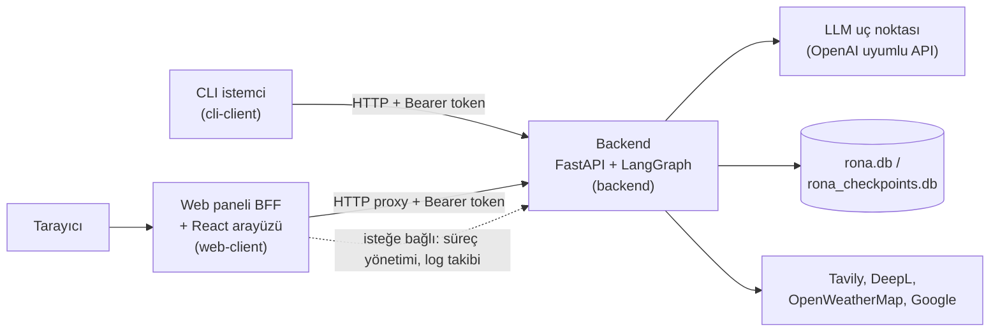

# Rona

**[Read this in English](README.en.md)**

Rona; kendi sunucunuzda barındırdığınız, herhangi bir OpenAI API uyumlu dil modeline bağlanabilen kişisel bir yapay zeka asistanı platformudur. Tek bir sohbet penceresinden ibaret değildir: birbirinden bağımsız olarak çalıştırılabilen üç parçadan oluşur — bir **backend** (ajan çekirdeği), bir **CLI istemcisi** ve bir **web paneli** — ve gerçek yeteneklerle gelir: web'de arama yapabilir, hava durumuna bakabilir, metin çevirebilir, Google Takvim/Kişiler/Gmail hesaplarınızı yönetebilir, konuşmalar arasında sizinle ilgili bilgileri anlamsal aramayla hatırlayabilir, uzun süren işleri arka planda çalışan alt ajanlara devredebilir ve siz çevrimdışıyken bile kendiliğinden çalışan zamanlanmış görevler oluşturabilir.

Bu depo — **Rona Public Edition** — projenin kişisel verilerden, gizli anahtarlardan ve tek bir kullanıcıya özel varsayımlardan arındırılmış, herkese açık şablon halidir. Depoyu klonlayıp kendi LLM uç noktanızı ve API anahtarlarınızı tanımladığınızda, Rona kendi asistanınız haline gelir.

## İçindekiler

- [Genel Bakış](#genel-bakış)
- [Özellikler](#özellikler)
- [Örnek Kullanım](#örnek-kullanım)
- [Proje Yapısı](#proje-yapısı)
- [Gereksinimler](#gereksinimler)
- [Kurulum ve Çalıştırma](#kurulum-ve-çalıştırma)
  - [Windows](#windows)
  - [macOS](#macos)
  - [Linux](#linux)
- [Yapılandırma Referansı](#yapılandırma-referansı)
- [Mimari](#mimari)
- [Test](#test)
- [Kimliği ve Davranışı Özelleştirme](#kimliği-ve-davranışı-özelleştirme)
- [Güvenlik Notları](#güvenlik-notları)
- [Lisans](#lisans)

## Genel Bakış

Rona, bir **FastAPI** sunucusu ve bir **LangGraph** durum makinesi üzerine kurulu bir ajan çekirdeğidir. Kullanıcıdan gelen her mesaj, bir dil modeline araç tanımlarıyla birlikte iletilir; model gerektiğinde araç çağırır, sonuçları değerlendirir ve gerektiğinde tekrar araç çağırarak döngüye devam eder. Hassas işlemler (e-posta gönderme, veri silme gibi) kullanıcıdan doğal dilde onay istenmeden çalıştırılmaz.

Backend'in dışında iki bağımsız istemci bulunur: bağımlılıksız bir **CLI istemcisi** ve backend'e yalnızca HTTP üzerinden bağlanan, kendi başına dağıtılabilen bir **React tabanlı web paneli**. Üç bileşen de aynı sunucuda çalışabileceği gibi, farklı makinelere de dağıtılabilir.

## Özellikler

### Sohbet ve ajan çekirdeği
- Tek seferlik (`/chat`) ve canlı akışlı (`/chat/stream`, Server-Sent Events ile) sohbet uç noktaları; akış modunda araç çağrıları, ilerleme adımları ve ara durumlar anlık olarak istemciye iletilir.
- Konuşma geçmişi LangGraph'ın SQLite tabanlı checkpoint mekanizmasıyla kalıcı olarak saklanır; sunucu yeniden başlasa bile konuşma kaldığı yerden devam eder. Boşta kalan konuşmalar yapılandırılabilir bir süre sonra otomatik temizlenir.
- İki katmanlı model desteği: hızlı/varsayılan **flash** katmanı ve isteğe bağlı, derin akıl yürütme gerektiren işler için **pro** katmanı. Her ikisi de herhangi bir OpenAI API uyumlu uç noktayla (OpenAI, OpenRouter, Azure OpenAI, yerel vLLM/Ollama vb.) çalışır; özel istek başlıkları tanımlanabilir.

### Araç kutusu (toolbox)
Modelin otomatik olarak kullanabildiği 30 hazır araç:

| Kategori | Araçlar |
|---|---|
| Zaman, arama, web | `get_time`, `web_search` (Tavily), `web_scraper`, `get_weather` (OpenWeatherMap), `translate_text` (DeepL) |
| Google Takvim | `get_events`, `add_event`, `edit_event`, `delete_event` |
| Google Kişiler | `get_contacts`, `add_contact`, `edit_contact`, `delete_contact` |
| Gmail | `send_email`, `get_recent_emails` |
| Yerel notlar | `add_note`, `get_notes`, `edit_note`, `delete_note` |
| Yerel kişi kayıtları | `add_person`, `get_people`, `edit_person`, `delete_person`, `search_person` |
| Bellek sistemi | `add_memory`, `get_memories`, `edit_memory`, `delete_memory`, `search_memories` |
| Alt ajanlar | `start_subagent`, `list_subagents`, `get_subagent_report`, `dismiss_subagent_report` |
| Zamanlanmış görevler | `create_task`, `list_tasks`, `get_task`, `update_task`, `delete_task`, `get_task_run`, `dismiss_task_run` |

### Semantik bellek sistemi
Rona sizinle ilgili bilgileri üç katmanda saklar: **deep** (kalıcı, tanımlayıcı gerçekler), **seasonal** (orta vadeli projeler/planlar) ve **short** (güncel konuşma bağlamı). Her anı bir kişiye bağlanabilir ya da genel/konu bazlı bırakılabilir. Anılar bir embedding modeliyle vektöre çevrilir ve `search_memories` ile anlamsal olarak (kelime eşleşmesi değil, anlam benzerliğiyle) aranır.

### Arka plan alt ajanları (subagents)
Uzun sürecek işler (`start_subagent`) ana sohbeti bloklamadan, kendi araç döngüsü ve tur limitiyle arka planda çalışır. İş bitince sonucu özetleyen ayrı bir raporlama katmanı devreye girer ve ana ajan bir sonraki mesajında kullanıcıya sonucu otomatik bildirir.

### Zamanlanmış görevler (trigger sistemi)
Bir kerelik, günlük, haftalık, aylık, yıllık veya ham cron ifadesiyle tanımlanabilen görevler, sunucu tarafında **APScheduler** ile siz çevrimdışıyken bile tetiklenir. Bir görev; isteğe bağlı bir doğal dil koşulu (ör. "hava yağmurlu değilse"), önceden onaylanmış araç çağrıları ve yeniden deneme/zaman aşımı politikası taşıyabilir.

### Onay (confirmation) akışı
E-posta gönderme, etkinlik/kişi/anı silme gibi hassas araç çağrıları LangGraph'ın `interrupt()` mekanizmasıyla durdurulur. Ayrı bir LLM katmanı çağrıyı doğal dilde bir onay sorusuna çevirir; kullanıcının serbest metinle verdiği yanıt yine bir LLM tarafından onay/red olarak yorumlanır.

### Modüler kimlik ve davranış promptları
Kişilik, çıktı biçimi, kullanıcı profili, araç kullanım kuralları, alt ajan kuralları ve görev kuralları ayrı markdown dosyalarında tutulur ve sistem mesajı olarak birleştirilir. Kod dokunmadan yalnızca bu dosyaları düzenleyerek asistanın kişiliğini ve kurallarını değiştirebilirsiniz.

### CLI istemci
Üçüncü parti bağımlılığı olmayan, tek dosyalık bir Python betiği. Hem etkileşimli bir REPL olarak hem de tek seferlik komut satırı mesajı göndermek için kullanılabilir.

### Web paneli
React + Vite + TypeScript ile yazılmış bir tek sayfa uygulaması: canlı akışlı, markdown destekli bir sohbet arayüzü ve tam bir yönetim paneli (sunucu durumu, dış bağlantı sağlık kontrolü, canlı log takibi, zamanlanmış görev ve alt ajan listeleri, notlar/kişiler/anılar için veri tarayıcısı, araç kataloğu, `.env` düzenleyici). Panel, backend'e yalnızca HTTP üzerinden bağlanan bağımsız bir FastAPI "backend-for-frontend" katmanı üzerinde çalışır ve backend'in Python koduna hiçbir şekilde bağımlı değildir.

### Dağıtım ve süreç yönetimi
Web paneli, geliştirme kolaylığı için backend sürecini yerelde başlatıp durdurabilir ve loglarını takip edebilir; backend de isteğe bağlı olarak açılışta web panelini kendisiyle birlikte otomatik başlatabilir. Linux için her iki bileşen adına hazır `systemd` kullanıcı servis dosyaları depoda yer alır.

## Örnek Kullanım

Rona ile web panelindeki sohbet ekranından ya da CLI istemciden aynı doğal dille konuşursunuz. Birkaç örnek:

- "Yarın saat 15:00'te Ayşe'ye 'toplantıyı unutma' diye e-posta at." → onay sorusu sorar, onayladığınızda gönderir.
- "Her hafta içi sabah 09:00'da bugünkü takvimimi özetle." → tekrarlayan bir zamanlanmış görev oluşturur.
- "İstanbul'daki en iyi 5 kahve dükkanını araştır ve karşılaştır." → arka planda bir alt ajan başlatır, siz başka bir şey konuşurken çalışmaya devam eder.
- "Geçen ay konuştuğumuz proje fikrini hatırlıyor musun?" → anılarında anlamsal arama yapar.
- "Bu ekran görüntüsündeki hatayı İngilizceye çevir." → `translate_text` aracını kullanır.

## Proje Yapısı

```
Rona Public Edition/
├── backend/            # FastAPI + LangGraph ajan çekirdeği ("beyin")
│   ├── app/            # FastAPI uygulaması, ayarlar, LLM istemcisi, prompt yükleyici
│   ├── graph/          # LangGraph durum makinesi (agent/tools/onay akışı)
│   ├── toolbox/        # Araç tanımları (tools.json) + araç uygulamaları + yerel SQLite
│   ├── trigger/        # Zamanlanmış görev planlayıcı ve yürütücü (APScheduler)
│   ├── subagents/      # Arka plan alt ajan çalıştırıcısı
│   ├── prompts/        # Kimlik/davranış prompt dosyaları (markdown)
│   ├── tests/          # pytest test paketi
│   ├── deploy/         # systemd servis dosyası
│   ├── run.py, create_db.py, requirements*.txt, .env.example
├── cli-client/         # Bağımsız, bağımlılıksız komut satırı istemcisi
│   ├── client.py, test_endpoints.ps1
├── web-client/         # Web kontrol paneli
│   ├── webui/          # FastAPI "backend-for-frontend" (proxy, süreç yönetimi, statik sunum)
│   ├── frontend/       # React + Vite + TypeScript kaynak kodu
│   ├── deploy/         # systemd servis dosyası
│   ├── tests/, requirements.txt, .env.example
└── .gitignore
```

## Gereksinimler

- **Python 3.11 veya üzeri** (kod tabanı `str | None` gibi birleşim tip söz dizimini kullandığından minimum 3.10 gerekir)
- **Node.js 18 veya üzeri** ve npm (yalnızca web panelinin arayüzünü derlemek için gerekir; backend'i veya CLI'yi kullanmak için gerekmez)
- **Git**
- OpenAI API uyumlu bir LLM uç noktası ve API anahtarı (sohbetin çalışması için zorunlu)
- İsteğe bağlı üçüncü parti anahtarlar: Tavily (web araması), DeepL (çeviri), OpenWeatherMap (hava durumu), bir Google Cloud OAuth istemci kimliği (Takvim/Kişiler/Gmail) ve bir Google Gemini API anahtarı (bellek aramasının embedding modeli için)

## Kurulum ve Çalıştırma

Üç bileşen de birbirinden bağımsız sanal ortamlar ve `.env` dosyaları kullanır; hiçbir `.env` dosyası birbirine ya da depoya kopyalanmamalıdır. Aşağıda işletim sistemine göre ayrı ayrı adımlar verilmiştir; kendi işletim sisteminize ait bölümü baştan sona takip etmeniz yeterlidir.

### Windows

#### 1. Ön koşullar
[python.org](https://www.python.org/downloads/) üzerinden Python (kurulumda **"Add python.exe to PATH"** kutusunu işaretleyin), [nodejs.org](https://nodejs.org/) üzerinden Node.js LTS ve [git-scm.com](https://git-scm.com/) üzerinden Git kurun. Alternatif olarak, `winget` yüklüyse PowerShell'den:

```powershell
winget install Python.Python.3.12
winget install OpenJS.NodeJS.LTS
winget install Git.Git
```

#### 2. Depoyu klonlama

```powershell
git clone https://github.com/Tech-06/Rona-Public-Edition.git
cd "Rona-Public-Edition"
```

#### 3. Backend

```powershell
cd backend
python -m venv .venv
.venv\Scripts\Activate.ps1
pip install -r requirements.txt
copy .env.example .env
notepad .env
```

> PowerShell betik çalıştırmayı engelliyorsa (`Activate.ps1 . dosyasını çalıştıramıyor` hatası), önce `Set-ExecutionPolicy -Scope Process -ExecutionPolicy Bypass` komutunu çalıştırın.

`.env` içinde en az `AUTH_TOKEN`, `FLASH_MODEL`, `FLASH_MODEL_URL` ve `FLASH_MODEL_API` alanlarını doldurun (bkz. [Yapılandırma Referansı](#yapılandırma-referansı)). Ardından veritabanını oluşturup sunucuyu başlatın:

```powershell
python create_db.py
python run.py
```

Backend artık `http://127.0.0.1:8000` adresinde çalışıyor. Google Takvim/Kişiler/Gmail araçlarını kullanacaksanız, Google Cloud Console'dan indirdiğiniz OAuth istemci dosyasını `backend\toolbox\tools\credentials.json` olarak yerleştirin ve her hesap için bir kez şunu çalıştırın (tarayıcı açılır, izin verirsiniz):

```powershell
python -m toolbox.tools.add_account <hesap_adi>
```

#### 4. CLI istemci

Yeni bir terminalde (backend çalışırken):

```powershell
cd cli-client
python client.py
```

Argümansız çalıştırıldığında etkileşimli bir sohbet başlar (`/health`, `/new`, `/exit` komutlarını destekler). Tek seferlik mesaj için:

```powershell
python client.py "merhaba"
```

Token, sırasıyla `--token` argümanından, `AUTH_TOKEN` ortam değişkeninden ya da `backend\.env` dosyasından otomatik okunur.

#### 5. Web paneli

```powershell
cd web-client
python -m venv .venv
.venv\Scripts\Activate.ps1
pip install -r requirements.txt
copy .env.example .env
notepad .env
```

`.env` içindeki `AUTH_TOKEN` değerinin `backend\.env` içindekiyle **birebir aynı** olması gerekir. Ardından arayüzü derleyin ve paneli başlatın:

```powershell
cd frontend
npm install
npm run build
cd ..
python -m webui start
```

Panel `http://127.0.0.1:8016` adresinde açılır. Durumunu kontrol etmek veya durdurmak için `python -m webui status` / `python -m webui stop` / `python -m webui restart` kullanılabilir.

> **Geliştirme modu:** Arayüzde canlı yeniden yükleme ile çalışmak isterseniz, bir terminalde `uvicorn webui.server:app --reload --port 8016` ile BFF'yi, başka bir terminalde `web-client/frontend` içinde `npm run dev` ile Vite geliştirme sunucusunu çalıştırın; Vite, `/api`, `/chat`, `/host` ve `/health` isteklerini otomatik olarak 8016 portuna yönlendirir.

Windows'ta `systemd` bulunmadığından, Rona'yı arka planda kalıcı bir servis olarak çalıştırmak isterseniz Görev Zamanlayıcı'da oturum açılışında çalışacak bir görev tanımlayabilir ya da NSSM gibi bir araçla `run.py`/`uvicorn`'u bir Windows servisine sarabilirsiniz; proje hazır bir Windows servis tanımı içermez.

### macOS

#### 1. Ön koşullar

[Homebrew](https://brew.sh/) kuruluysa:

```bash
brew install python@3.12 node git
```

#### 2. Depoyu klonlama

```bash
git clone https://github.com/Tech-06/Rona-Public-Edition.git
cd Rona-Public-Edition
```

#### 3. Backend

```bash
cd backend
python3 -m venv .venv
source .venv/bin/activate
pip install -r requirements.txt
cp .env.example .env
nano .env   # veya tercih ettiğiniz herhangi bir editör
```

`.env` içinde en az `AUTH_TOKEN`, `FLASH_MODEL`, `FLASH_MODEL_URL` ve `FLASH_MODEL_API` alanlarını doldurun. Ardından:

```bash
python create_db.py
python run.py
```

Backend `http://127.0.0.1:8000` adresinde çalışır. Google entegrasyonları için `credentials.json` dosyasını `backend/toolbox/tools/credentials.json` konumuna koyup her hesap için bir kez şunu çalıştırın:

```bash
python -m toolbox.tools.add_account <hesap_adi>
```

#### 4. CLI istemci

```bash
cd cli-client
python3 client.py
```

veya tek seferlik: `python3 client.py "merhaba"`.

#### 5. Web paneli

```bash
cd web-client
python3 -m venv .venv
source .venv/bin/activate
pip install -r requirements.txt
cp .env.example .env
nano .env   # AUTH_TOKEN'ı backend/.env ile birebir aynı yapın
cd frontend
npm install
npm run build
cd ..
python -m webui start
```

Panel `http://127.0.0.1:8016` adresinde açılır; `python -m webui status`/`stop`/`restart` ile yönetilir. Geliştirme modu için Windows bölümündeki `uvicorn --reload` + `npm run dev` notu aynen geçerlidir.

macOS `systemd` kullanmadığından, kalıcı arka plan çalıştırma için `~/Library/LaunchAgents` altına bir `launchd` ajanı tanımlayabilir ya da geliştirme/deneme amaçlı `tmux`/`screen` gibi bir terminal çoklayıcı kullanabilirsiniz; proje hazır bir `launchd` tanımı içermez.

### Linux

#### 1. Ön koşullar

Debian/Ubuntu:

```bash
sudo apt update
sudo apt install python3 python3-venv python3-pip nodejs npm git
```

Fedora:

```bash
sudo dnf install python3 nodejs npm git
```

#### 2. Depoyu klonlama

Hazır `systemd` servis dosyaları `%h/rona/backend` ve `%h/rona/web-client` yollarını (`%h` = ev dizininiz) varsayar; servis dosyalarını değiştirmeden kullanmak isterseniz depoyu bu yola klonlayın:

```bash
git clone https://github.com/Tech-06/Rona-Public-Edition.git ~/rona
cd ~/rona
```

(Farklı bir konuma klonlarsanız, aşağıdaki 6. adımda servis dosyalarındaki yolları güncellemeniz yeterlidir.)

#### 3. Backend

```bash
cd backend
python3 -m venv .venv
source .venv/bin/activate
pip install -r requirements.txt
cp .env.example .env
nano .env
python create_db.py
python run.py
```

Google entegrasyonları için `credentials.json` dosyasını `backend/toolbox/tools/credentials.json` konumuna koyup her hesap için bir kez `python -m toolbox.tools.add_account <hesap_adi>` çalıştırın (bu adım masaüstü ortamlı bir oturumda, tarayıcı açılabilecek şekilde yapılmalıdır).

#### 4. CLI istemci

```bash
cd ../cli-client
python3 client.py
```

#### 5. Web paneli

```bash
cd ../web-client
python3 -m venv .venv
source .venv/bin/activate
pip install -r requirements.txt
cp .env.example .env
nano .env   # AUTH_TOKEN'ı backend/.env ile birebir aynı yapın
cd frontend
npm install
npm run build
cd ..
python -m webui start
```

Panel `http://127.0.0.1:8016` adresinde açılır.

#### 6. systemd ile kalıcı servis olarak çalıştırma (isteğe bağlı, önerilir)

Backend ve web paneli için hazır kullanıcı servis dosyaları depoda bulunur. Her ikisi de `%h/rona/backend/.venv` ve `%h/rona/web-client/.venv` altında bir sanal ortam bekler (yukarıdaki 3. ve 5. adımlarda oluşturuldu):

```bash
mkdir -p ~/.config/systemd/user
cp ~/rona/backend/deploy/rona.service ~/.config/systemd/user/
cp ~/rona/web-client/deploy/rona-web.service ~/.config/systemd/user/
systemctl --user daemon-reload
systemctl --user enable --now rona.service
systemctl --user enable --now rona-web.service
```

Oturum kapatıldığında kullanıcı servislerinin de durmaması için:

```bash
sudo loginctl enable-linger $USER
```

Durumu kontrol etmek ve logları izlemek için:

```bash
systemctl --user status rona.service rona-web.service
journalctl --user -u rona.service -u rona-web.service -f
```

Depoyu `~/rona` dışında bir yere klonladıysanız, kopyaladığınız `.service` dosyalarındaki `WorkingDirectory`, `ExecStart` ve (web paneli için) `EnvironmentFile` satırlarını gerçek yola göre düzenleyin.

## Yapılandırma Referansı

### `backend/.env`

| Değişken | Zorunlu | Varsayılan | Açıklama |
|---|---|---|---|
| `AUTH_TOKEN` | Evet | — | Tüm backend uç noktalarını koruyan bearer token; rastgele üretin (ör. `openssl rand -hex 32`) |
| `FLASH_MODEL` / `FLASH_MODEL_URL` / `FLASH_MODEL_API` | Evet | — | Varsayılan ("flash") model adı, uç nokta adresi ve API anahtarı |
| `FLASH_MODEL_HEADERS` | Hayır | `{}` | JSON formatında ekstra istek başlıkları |
| `PRO_MODEL` / `PRO_MODEL_URL` / `PRO_MODEL_API` / `PRO_MODEL_HEADERS` | Hayır | boş | İsteğe bağlı "pro" katmanı; boş bırakılırsa alt ajanlar ve görevler "pro" istendiğinde hata verir |
| `RELOAD` | Hayır | `true` | Kod değişikliğinde otomatik yeniden başlatma |
| `LOG_LEVEL` / `LOG_FILE` | Hayır | `INFO` / `rona.log` | Log seviyesi ve dosya yolu |
| `CONVERSATION_TTL_SECONDS` | Hayır | `7200` | Boşta kalan konuşmaların silinme süresi |
| `MAX_HISTORY_MESSAGES` | Hayır | `50` | Modele gönderilen geçmiş mesaj sınırı |
| `LLM_TIMEOUT_SECONDS` | Hayır | `120` | Model isteği zaman aşımı |
| `GRAPH_RECURSION_LIMIT` | Hayır | `100` | Tek bir turdaki ajan/araç döngüsü sınırı |
| `SUBAGENT_MAX_ROUNDS`, `SUBAGENT_TIMEOUT_SECONDS`, `SUBAGENT_MAX_CONCURRENT`, `SUBAGENT_RETENTION_HOURS`, `SUBAGENT_LLM_TIMEOUT_SECONDS`, `SUBAGENT_MAX_CONTEXT_MESSAGES` | Hayır | bkz. `.env.example` | Alt ajan sisteminin tur/zaman aşımı/eşzamanlılık/saklama ayarları |
| `TRIGGER_TIMEZONE` | Hayır | `UTC` | Zamanlanmış görevlerin varsayılan saat dilimi (IANA, ör. `Europe/Istanbul`) |
| `TRIGGER_MAX_CONCURRENT`, `TRIGGER_MAX_ROUNDS`, `TRIGGER_LLM_TIMEOUT_SECONDS`, `TRIGGER_MAX_CONTEXT_MESSAGES` | Hayır | bkz. `.env.example` | Görev yürütücüsünün eşzamanlılık/tur/zaman aşımı ayarları |
| `TAVILY_API_KEY` | Hayır | — | `web_search` aracı için |
| `DEEPL_API_KEY` | Hayır | — | `translate_text` aracı için |
| `OPENWEATHER_API_KEY` | Hayır | — | `get_weather` aracı için |
| `GOOGLE_API_KEY` + `EMBEDDING_MODEL_NAME` | Hayır | — | Bellek sisteminin semantik arama embedding'i (Gemini) için |
| `WEB_AUTOSTART` | Hayır | `false` | Backend açılırken web panelini otomatik başlatsın mı |
| `WEB_CLIENT_DIR` | Hayır | `../web-client` | Web panelinin göreli klasör konumu (yalnızca `WEB_AUTOSTART=true` iken kullanılır) |

Google Takvim/Kişiler/Gmail araçları ayrıca bir ortam değişkeni değil, doğrudan bir dosya olarak `backend/toolbox/tools/credentials.json` (Google Cloud Console'dan alınan OAuth istemci kimliği) gerektirir; her hesabın yetkilendirme jetonu `python -m toolbox.tools.add_account <hesap_adi>` çalıştırıldığında aynı klasöre `token_<hesap_adi>.json` olarak yazılır.

### `web-client/.env`

| Değişken | Zorunlu | Varsayılan | Açıklama |
|---|---|---|---|
| `AUTH_TOKEN` | Evet | — | `backend/.env` içindeki `AUTH_TOKEN` ile birebir aynı olmalı |
| `WEB_HOST` / `WEB_PORT` | Hayır | `127.0.0.1` / `8016` | Panelin dinleyeceği adres ve port |
| `BACKEND_URL` | Hayır | `http://127.0.0.1:8000` | Backend'in adresi |
| `WEB_ALLOWED_HOSTS` | Hayır | `localhost,127.0.0.1` | `TrustedHostMiddleware` izin listesi |
| `LOG_LEVEL` | Hayır | `INFO` | Log seviyesi |
| `BACKEND_DIR` | Hayır | `../backend` | Yalnızca yerel geliştirme kolaylıkları (backend'i başlat/durdur, log takibi, salt-okunur veritabanı görünümü) için; yol geçersizse bu özellikler sessizce "kullanılamıyor" döner, panel çalışmaya devam eder |
| `BACKEND_LOG_FILE` | Hayır | `rona.log` | `BACKEND_DIR` içinde takip edilecek log dosyasının adı |

## Mimari

Rona, birbirine yalnızca HTTP üzerinden bağlanan üç bağımsız bileşenden oluşur. Hiçbir bileşen bir diğerinin Python paketini import etmez — bu, `web-client/tests/test_webui_isolation.py` testiyle güvence altına alınmıştır — bu sayede her biri farklı sunucularda, farklı zamanlarda ve farklı bağımlılık kümeleriyle bağımsız olarak dağıtılabilir.



### Backend

`backend/`, FastAPI üzerinde çalışan tek gerçek "beyin"dir:

- **`app/`** — FastAPI uygulaması (`main.py`), Pydantic Settings tabanlı yapılandırma (`config.py`), OpenAI istemcisi (`llm.py`), yönetim API'si (`dashboard.py`) ve prompt yükleyici (`prompts.py`).
- **`graph/`** — LangGraph ile tanımlanmış durum makinesi. Her sohbet turu `agent` düğümünden başlar; modelin dönüşüne göre ya biter, ya doğrudan `tools` düğümüne (araç sonuçlarıyla tekrar `agent`'a döner), ya da hassas bir araç çağrısı varsa önce `ask_confirmation` → `await_confirmation` üzerinden kullanıcı onayından geçer:

  ```mermaid
  stateDiagram-v2
      [*] --> agent
      agent --> [*]: yanıt hazır (araç çağrısı yok)
      agent --> tools: onay gerektirmeyen araç çağrısı
      agent --> ask_confirmation: onay gerektiren araç çağrısı
      ask_confirmation --> await_confirmation: soru kullanıcıya iletildi
      await_confirmation --> tools: kullanıcı yanıtı yorumlandı
      tools --> agent: araç sonuçları eklendi
  ```

  `await_confirmation` düğümü, LangGraph'ın `interrupt()` mekanizmasıyla yürütmeyi gerçekten durdurur ve konuşmayı checkpoint'e yazar; kullanıcının yanıtı geldiğinde kaldığı yerden devam eder.
- **`toolbox/`** — `tools.json` içinde tanımlı araç şemaları, `toolbox/tools/` altında bunların Python uygulamaları, ve yerel verilerin (notlar, kişiler, anılar, görevler, alt ajan kayıtları) tutulduğu `rona.db` SQLite veritabanına erişim (`db.py`, `registry.py`).
- **`trigger/`** — `APScheduler` tabanlı zamanlayıcı (`scheduler.py`), görev tanımlarının doğrulanması ve kalıcılığı (`store.py`) ve tetiklendiğinde çalışan headless ajan (`executor.py`).
- **`subagents/`** — arka plan görevlerini kendi tur limiti ve kendi araç alt kümesiyle çalıştıran asenkron çalıştırıcı (`runner.py`) ve durum kaydı (`store.py`).
- **`prompts/`** — sistem promptu, sırasıyla `persona.md`, `output_text.md`, `user.md`, `toolbox.md`, `subagents.md`, `trigger.md` dosyalarının birleştirilmesiyle oluşur (bkz. [Kimliği ve Davranışı Özelleştirme](#kimliği-ve-davranışı-özelleştirme)).
- **Depolama** — `rona.db` (notlar, kişiler, anılar, zamanlanmış görevler ve çalıştırmaları, alt ajan çalıştırmaları) ve `rona_checkpoints.db` (LangGraph'ın konuşma durumu checkpoint'leri); her ikisi de `create_db.py` ile oluşturulur ve `.gitignore` ile depodan hariç tutulur.

Backend'in ana uç noktaları `/health`, `/chat`, `/chat/stream`'dir; yönetim/izleme amaçlı geniş bir `/api/*` uç nokta kümesi (durum, bağlantı sağlık kontrolü, yapılandırma okuma/yazma, görev ve alt ajan CRUD işlemleri, veri tarayıcı, canlı log akışı) `app/dashboard.py` içinde tanımlıdır ve web paneli tarafından kullanılır. Tüm uç noktalar bearer token ile korunur.

### Web-client

`web-client/`, backend'den tamamen bağımsız, kendi `.env`'ini okuyan bir **FastAPI BFF (backend-for-frontend)** katmanıdır:

- **`webui/server.py`** — `/api/*`, `/chat`, `/chat/stream`, `/health` isteklerini backend'e proxy'ler (`proxy.py`); derlenmiş React arayüzünü (`frontend/`'den `npm run build` ile üretilen `webui/dist/`) statik dosya olarak sunar; bir CSRF koruma ara katmanı (güvenli olmayan metodlarda `Content-Type`/`Sec-Fetch-Site` kontrolü) ve `TrustedHostMiddleware` uygular.
- **`webui/host.py`** — yalnızca yerel geliştirme kolaylığı için: `BACKEND_DIR` altında backend sürecini başlatıp durdurma, logunu kuyruklama, `systemctl` varsa onun üzerinden yönetme (`/host/*` uç noktaları). Backend farklı bir makinede çalışıyorsa bu uç noktalar devre dışı kalır, panel yine de proxy üzerinden backend'e bağlanmaya devam eder.
- **`webui/db.py`** — `BACKEND_DIR` içindeki `rona.db`'yi salt okunur açıp bazı yönetim görünümlerini (`/host/db/tasks`, `/host/db/subagents`) "degraded" (backend API'sinden değil, doğrudan dosyadan) modda sunar; dosya bulunamazsa boş sonuç döner.
- **`webui/supervisor.py`** — `python -m webui start|stop|restart|status` komutunu uygulayan, panelin kendi `uvicorn` sürecini yöneten basit bir denetleyici.
- **`frontend/`** — React + Vite + TypeScript kaynak kodu: canlı akışlı sohbet arayüzü (`components/chat/`) ve durum/bağlantı/yapılandırma/araç/görev/alt ajan/log/veri panellerinden oluşan yönetim arayüzü (`components/dashboard/`).

### CLI istemci

`cli-client/client.py`, üçüncü parti bağımlılığı olmayan tek dosyalık bir Python betiğidir; backend'in `/health` ve `/chat` uç noktalarına doğrudan HTTP isteği atar. Token'ı `--token` argümanından, `AUTH_TOKEN` ortam değişkeninden ya da `backend/.env` dosyasından okur. `test_endpoints.ps1`, aynı uç noktaları `curl.exe` ile hızlıca sınamak için bir PowerShell betiğidir.

## Test

Backend testleri:

```bash
cd backend
pip install -r requirements-dev.txt
pytest -q
```

Web-client testleri (backend'in Python paketlerinin hiçbir şekilde import edilmediğini doğrulayan izolasyon testi dahil):

```bash
cd web-client
pip install -r requirements.txt pytest
pytest -q
```

## Kimliği ve Davranışı Özelleştirme

`backend/prompts/` altındaki dosyalar sistem promptunu oluşturur ve iki kategoriye ayrılır:

- **Kimlik (sizin doldurmanız gereken):** `backend/prompts/user.md` — bu depoda kasıtlı olarak boş, doldurulacak alanlar içeren bir şablon halinde bırakılmıştır. Kim olduğunuz, ne iş yaptığınız, hangi teknolojileri kullandığınız ve Rona'nın sizinle nasıl etkileşmesini istediğiniz gibi bilgileri buraya siz yazarsınız.
- **Davranış (olduğu gibi çalışır, isterseniz düzenlersiniz):** `persona.md` (kişilik ve ton), `output_text.md` (biçimlendirme kuralları), `toolbox.md`/`subagents.md`/`trigger.md` (araç kullanım kuralları) — bunlar jeneriktir ve kişisel veri içermez; asistanın genel davranışını değiştirmek isterseniz düzenlemeniz gereken dosyalar bunlardır.

Asistanın adını değiştirmek isterseniz `backend/.env` içindeki `APP_NAME`'in yalnızca `/health` yanıtı ve FastAPI başlığı gibi yüzeysel yerlerde göründüğünü, `persona.md` içinde "Rona" adının ayrıca sabit metin olarak geçtiğini unutmayın — tam bir yeniden adlandırma için ikisini birlikte güncelleyin.

## Güvenlik Notları

- `.env` dosyaları, `rona.db`/`rona_checkpoints.db`, log dosyaları ve Google OAuth kimlik/jeton dosyaları (`credentials.json`, `token_*.json`) `.gitignore` ile depodan tamamen hariç tutulmuştur — bunları asla commit etmeyin.
- Backend'in tüm uç noktaları `AUTH_TOKEN` ile korunur; bu token'ı tahmin edilemeyecek şekilde rastgele üretin ve kimseyle paylaşmayın.
- Web paneli, backend ile aynı `AUTH_TOKEN`'ı kullanır ve isteklerinizi backend'e bu token ile proxy'ler; paneli `127.0.0.1` dışına açacaksanız (ör. `WEB_HOST=0.0.0.0`) mutlaka bir ters proxy arkasında TLS ile sunun ve `WEB_ALLOWED_HOSTS`'u gerçek alan adınızla sınırlayın.
- Hassas araç çağrıları (e-posta gönderme, veri silme, "deep" katmanına bellek yazma vb.) her zaman kullanıcı onayından geçer; `create_task` ile önceden onaylanan çağrılar yalnızca tanımlandıkları parametrelerle çalışabilir, yürütücü bunları değiştiremez.
- Herhangi bir anahtarın veya token'ın sızdığından şüpheleniyorsanız ilgili sağlayıcıda hemen iptal edip yeniden oluşturun ve `AUTH_TOKEN`'ı değiştirin.