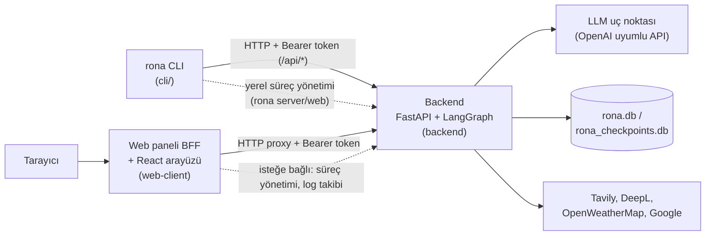

# Rona

**[Read this in English](README.en.md)**

Rona; kendi sunucunuzda barındırdığınız, herhangi bir OpenAI API uyumlu dil modeline bağlanabilen kişisel bir yapay zeka asistanı platformudur. Tek bir sohbet penceresinden ibaret değildir: birbirinden bağımsız olarak çalıştırılabilen üç parçadan oluşur — bir **backend** (ajan çekirdeği), terminalden yöneten bir **CLI aracı** (`rona`) ve bir **web paneli** — ve gerçek yeteneklerle gelir: web'de arama yapabilir, hava durumuna bakabilir, metin çevirebilir, Google Takvim/Kişiler/Gmail hesaplarınızı yönetebilir, konuşmalar arasında sizinle ilgili bilgileri anlamsal aramayla hatırlayabilir, uzun süren işleri arka planda çalışan alt ajanlara devredebilir ve siz çevrimdışıyken bile kendiliğinden çalışan zamanlanmış görevler oluşturabilir.

## İçindekiler

- [Genel Bakış](#genel-bakış)
- [Özellikler](#özellikler)
- [Örnek Kullanım](#örnek-kullanım)
- [Proje Yapısı](#proje-yapısı)
- [Gereksinimler](#gereksinimler)
- [Kurulum ve Çalıştırma](#kurulum-ve-çalıştırma)
  - [Hızlı kurulum](#hızlı-kurulum-önerilen)
  - [`rona` komut referansı](#rona-komut-referansı)
  - [Güncelleme](#güncelleme)
  - [Telefona uygulama olarak kurma (PWA)](#telefona-uygulama-olarak-kurma-pwa)
  - [Kaldırma](#kaldırma)
  - [İleri düzey: elle kurulum](#i̇leri-düzey-elle-kurulum)
- [Yapılandırma Referansı](#yapılandırma-referansı)
- [Mimari](#mimari)
- [Test](#test)
- [Kimliği ve Davranışı Özelleştirme](#kimliği-ve-davranışı-özelleştirme)
- [Güvenlik Notları](#güvenlik-notları)
- [Lisans](#lisans)

## Genel Bakış

Rona, bir **FastAPI** sunucusu ve bir **LangGraph** durum makinesi üzerine kurulu bir ajan çekirdeğidir. Kullanıcıdan gelen her mesaj, bir dil modeline araç tanımlarıyla birlikte iletilir; model gerektiğinde araç çağırır, sonuçları değerlendirir ve gerektiğinde tekrar araç çağırarak döngüye devam eder. Hassas işlemler (e-posta gönderme, veri silme gibi) kullanıcıdan doğal dilde onay istenmeden çalıştırılmaz.

Backend'in dışında iki bağımsız bileşen bulunur: backend'i ve web panelini terminalden başlatan/durduran/yapılandıran, üçüncü parti bağımlılığı olmayan bir **CLI aracı** (`rona`), ve backend'e yalnızca HTTP üzerinden bağlanan, kendi başına dağıtılabilen bir **React tabanlı web paneli**. Üç bileşen de aynı sunucuda çalışabileceği gibi, farklı makinelere de dağıtılabilir.

## Özellikler

### Sohbet ve ajan çekirdeği
- Tek seferlik (`/chat`) ve canlı akışlı (`/chat/stream`, Server-Sent Events ile) sohbet uç noktaları; akış modunda araç çağrıları, ilerleme adımları ve ara durumlar anlık olarak istemciye iletilir.
- Konuşma geçmişi LangGraph'ın SQLite tabanlı checkpoint mekanizmasıyla kalıcı olarak saklanır; sunucu yeniden başlasa bile konuşma kaldığı yerden devam eder. Boşta kalan konuşmalar yapılandırılabilir bir süre sonra otomatik temizlenir.
- İki katmanlı model desteği: hızlı/varsayılan **flash** katmanı ve isteğe bağlı, derin akıl yürütme gerektiren işler için **pro** katmanı. Her ikisi de herhangi bir OpenAI API uyumlu uç noktayla (OpenAI, OpenRouter, Azure OpenAI, yerel vLLM/Ollama vb.) çalışır; özel istek başlıkları tanımlanabilir.

### Araç kutusu (toolbox)
Backend'de hazır gelen (kurulum gerektirmeyen) 22 çekirdek araç:

| Kategori | Araçlar |
|---|---|
| Web scraping | `web_scraper` |
| Yerel kişi kayıtları | `add_person`, `get_people`, `edit_person`, `delete_person`, `search_person` |
| Bellek sistemi | `add_memory`, `get_memories`, `edit_memory`, `delete_memory`, `search_memories` |
| Alt ajanlar | `start_subagent`, `list_subagents`, `get_subagent_report`, `dismiss_subagent_report` |
| Zamanlanmış görevler | `create_task`, `list_tasks`, `get_task`, `update_task`, `delete_task`, `get_task_run`, `dismiss_task_run` |

Web arama, hava durumu, çeviri, yerel notlar ve Google Takvim/Kişiler/Gmail gibi araçlar artık çekirdeğe gömülü değil: her biri ayrı bir **isteğe bağlı araç paketi** olarak [Rona Tools](https://github.com/Tech-06/Rona-Tools) kataloğundan tek tek kurulur, böylece hiçbir kurulum bu araçların bağımlılıklarını/API anahtarlarını zorunlu kılmaz. Kurulum sihirbazı bunu kurulum sırasında zaten sorar (bkz. [Hızlı kurulum](#hızlı-kurulum-önerilen)); sonradan eklemek/kaldırmak isterseniz `rona` ile:

```bash
rona tools available          # katalogtaki tüm paketleri listele
rona tools install <paket_id>
```

Katalogtaki paketler: `get_time`, `web_search` (Tavily), `weather` (OpenWeatherMap), `deepl_translate` (DeepL), `notes` (yerel not listesi), `google_auth` (paylaşılan Google OAuth, diğer üç Google paketi tarafından otomatik kurulur), `google_calendar`, `google_contacts`, `google_mail`. Her paket, gerekli API anahtarını/hesap listesini kurulum sırasında sorar, `.env`'e ya da paketin kendi ayar dosyasına yazar ve bir sağlık kontrolü çalıştırır. Diğer komutlar:

```bash
rona tools list               # kurulu paketleri listele
rona tools config <id>        # bir paketin ayarlarını göster/değiştir
rona tools actions <id>       # paketin sunduğu işlemleri listele
rona tools run <id> <işlem>   # bunlardan birini çalıştır
rona tools verify <id>        # bir paketin sağlık kontrolünü tekrar çalıştır
rona tools uninstall <id>
```

Bir paketin ayarları kurulumdan sonra da değişebilir: `rona tools config <id>` (ya da web panelinde **Ayarlar → Bağlantılar → Araç paketleri → Yapılandır**) aynı `.env`/`config.json` yollarını kullanır. Bazı paketler ayrıca **işlem** sunar -- araçlardan farklı olarak bunları model değil siz çağırırsınız (bir Google hesabını yetkilendirmek gibi); hem `rona tools run` ile hem de aynı panelden çalıştırılabilirler.

**Bağımlılıklar.** Bir paket, ihtiyaç duyduğu diğer paketleri kendi manifest'inde bildirir ve katalog bunu `index.json`'a da yazar; böylece kurulum, hiçbir şey indirmeden önce size ne olacağını söyleyebilir. `rona tools install google_calendar` önce "bu `google_auth`'u da kuracak" diye uyarır ve onay ister; kabul ederseniz `google_auth` tam olarak kurulup yapılandırıldıktan *sonra* asıl pakete geçilir. Başka bir paketin hâlâ ihtiyaç duyduğu bir paketi kaldırmak `--force` olmadan reddedilir.

`rona tools`, arka planda backend'in kendi `python -m toolbox.manager`'ına devreder (bkz. [`rona` komut referansı](#rona-komut-referansı)); backend'i elle kurduysanız aynı komutları doğrudan `backend/` içinden `python -m toolbox.manager ...` olarak da çalıştırabilirsiniz.

#### Google hesapları

Tek bir OAuth istemcisi istediğiniz kadar hesabı yetkilendirir; hesap adlarını siz seçersiniz (`kisisel`, `is`, ne isterseniz) ve sabit bir liste yoktur.

`google_auth` kurulurken (doğrudan ya da üç Google paketinden birinin bağımlılığı olarak) bir `credentials.json` ister: Google Cloud Console → APIs & Services → Credentials → OAuth client ID → **Desktop app**. Bu tek dosya bütün hesaplar için yeterlidir.

Hesap eklemek için web panelinde **Ayarlar → Bağlantılar → Araç paketleri → `google_auth` → Yapılandır → Add a Google account**, ya da:

```bash
rona tools run google_auth add_account
```

İkisi de size bir bağlantı verir. Bu bağlantıyı **herhangi bir cihazda** açabilirsiniz -- Rona'nın çalıştığı makine olmak zorunda değil. İzin verdikten sonra tarayıcı `http://localhost:47111/…` adresini açmaya çalışır ve "siteye ulaşılamıyor" hatası gösterir: bu beklenen davranıştır, orada dinleyen bir şey yok, önemli olan adres çubuğundaki adrestir. O adresi kopyalayıp geri yapıştırın, işlem tamam.

Sunucu kurulumlarını çalışır kılan şey budur. Eski `add_account.py` (hâlâ duruyor, `add_account_here` işlemi olarak) tarayıcıyı **backend'in çalıştığı makinede** açar ve yönlendirmeyi o makinenin `localhost`'unda bekler -- kendi bilgisayarınızda sorunsuz, SSH ile bağlandığınız bir sunucuda imkânsız.

Bir hesabı yetkilendirmek, onu herhangi bir aracın kullanabileceği anlamına gelmez: her Google paketinin kendi izinli hesap listesi vardır, böylece Takvim iki hesabı görürken Mail yalnızca birini görebilir. Aynı panelden ya da:

```bash
rona tools config google_calendar --set accounts=kisisel,is
```

`rona tools run google_auth list_accounts` yetkili hesapları ve token'larının hâlâ geçerli olup olmadığını gösterir; `remove_account` birini geri alır.

> **Daha önceki bir Rona sürümünden güncelliyorsanız:** `get_time`, `web_search`, `get_weather`, `translate_text`, notlar ve Google Takvim/Kişiler/Gmail araçları bu güncellemeyle çekirdekten kalktı ve modelin kullanabilir listesinden kayboldu. Geri almak için ilgili paketi kurmanız yeterli (yukarıya bakın). Notlarınız `rona.db` içindeki `notes` tablosunda olduğu gibi durur, `notes` paketini kurduğunuzda hemen görünür. Google credentials.json/`token_<hesap>.json` dosyalarınız ise eski konumda (`backend/toolbox/tools/`) kalır ve otomatik taşınmaz -- `google_auth` paketini kurarken `credentials.json`'ı yeniden seçin ve her hesabı `rona tools run google_auth add_account` ile tekrar yetkilendirin (eski token dosyalarını elle `backend/toolbox/custom/google_auth/` klasörüne kopyalarsanız yeniden yetkilendirmeye gerek kalmaz).

### Semantik bellek sistemi
Rona sizinle ilgili bilgileri üç katmanda saklar: **deep** (kalıcı, tanımlayıcı gerçekler), **seasonal** (orta vadeli projeler/planlar) ve **short** (güncel konuşma bağlamı). Her anı bir kişiye bağlanabilir ya da genel/konu bazlı bırakılabilir. Anılar bir embedding modeliyle vektöre çevrilir ve `search_memories` ile anlamsal olarak (kelime eşleşmesi değil, anlam benzerliğiyle) aranır.

Katmanı Rona kendisi, iki adımda seçer: önce zaman bağlamına bakar (bilgi "bu akşam" gibi yakın bir zamanı taşıyorsa → `short`, "bu dönem" gibi sınırlı bir süreyi taşıyorsa → `seasonal`); zaman bağlamı yoksa bilginin türüne bakar (bir özellik/tercih ya da bir kişi/ilişki → `deep`; bir proje/görev → `seasonal`; anlık bir bilgi → `short`). Modelin izlediği tam kurallar için `backend/prompts/memory.md`'ye bakın.

Katmanlar daha sonra periyodik bir **konsolidasyon** çalışmasıyla kendiliğinden yönetilir: yeterince hatırlanan bir `short` anı `seasonal`'a, daha da çok hatırlanan bir `seasonal` anı `deep`'e terfi eder; uzun süre hatırlanmayan bir `seasonal` anı arşive taşınır, az hatırlanan bir `short` anı ise birkaç gün sonra silinir — `deep` anılara asla dokunulmaz. Terfi, arşivleme ve silme ayrı ayrı kapatılabilir (varsayılanlar: 3/10 hatırlanmada terfi, 90 gün hareketsizlikte arşiv, 7 günde silme; bkz. [Yapılandırma Referansı](#yapılandırma-referansı)). "Hatırlanma" yalnızca Rona'nın kendi `search_memories` çağrılarını (ana sohbet, alt ajanlar, görevler) sayar — bir anının bir aramanın ilk birkaç sonucuna girmesi gerekir ve aynı anı bir bekleme süresi boyunca yalnızca bir kez sayılır; web panelinden ya da CLI'dan yapılan aramalar hiç sayılmaz.

Arşivlenen anılar `rona.db` içinde ayrı bir tabloya taşınır — artık aranamazlar, ama web panelinin Veri → Arşiv sekmesinden ya da `rona edit memory restore` ile `deep` olarak geri yüklenebilirler. Bir kişiyi silmek, o kişiye bağlı anıları doğrudan silmek yerine arşive taşır.

### Arka plan alt ajanları (subagents)
Uzun sürecek işler (`start_subagent`) ana sohbeti bloklamadan, kendi araç döngüsü ve tur limitiyle arka planda çalışır. İş bitince sonucu özetleyen ayrı bir raporlama katmanı devreye girer ve ana ajan bir sonraki mesajında kullanıcıya sonucu otomatik bildirir.

### Zamanlanmış görevler (trigger sistemi)
Bir kerelik, günlük, haftalık, aylık, yıllık veya ham cron ifadesiyle tanımlanabilen görevler, sunucu tarafında **APScheduler** ile siz çevrimdışıyken bile tetiklenir. Bir görev; isteğe bağlı bir doğal dil koşulu (ör. "hava yağmurlu değilse"), önceden onaylanmış araç çağrıları ve yeniden deneme/zaman aşımı politikası taşıyabilir.

### Onay (confirmation) akışı
E-posta gönderme, etkinlik/kişi/anı silme gibi hassas araç çağrıları LangGraph'ın `interrupt()` mekanizmasıyla durdurulur. Ayrı bir LLM katmanı çağrıyı doğal dilde bir onay sorusuna çevirir; kullanıcının serbest metinle verdiği yanıt yine bir LLM tarafından onay/red olarak yorumlanır.

### Modüler kimlik ve davranış promptları
Kişilik, çıktı biçimi, kullanıcı profili, araç kullanım kuralları, alt ajan kuralları ve görev kuralları ayrı markdown dosyalarında tutulur ve sistem mesajı olarak birleştirilir. Kod dokunmadan yalnızca bu dosyaları düzenleyerek asistanın kişiliğini ve kurallarını değiştirebilirsiniz.

### CLI aracı (`rona`)
Üçüncü parti bağımlılığı olmayan, `pip install -e .` ile kurulan stdlib-only bir Python paketi. Backend'i ve web panelini terminalden başlatır/durdurur/durumunu gösterir, model/auth/`.env` ayarlarını düzenler, zamanlanmış görevleri ve çalışma geçmişini listeler, canlı log akışını izler. Bkz. [`rona` komut referansı](#rona-komut-referansı) ve [cli/README.md](cli/README.md).

### Web paneli
React + Vite + TypeScript ile yazılmış bir tek sayfa uygulaması: canlı akışlı, markdown destekli bir sohbet arayüzü ve tam bir yönetim paneli (sunucu durumu, dış bağlantı sağlık kontrolü, canlı log takibi, zamanlanmış görev ve alt ajan listeleri, notlar/kişiler/anılar için veri tarayıcısı, araç kataloğu, `.env` düzenleyici). Panel, backend'e yalnızca HTTP üzerinden bağlanan bağımsız bir FastAPI "backend-for-frontend" katmanı üzerinde çalışır ve backend'in Python koduna hiçbir şekilde bağımlı değildir.

Sohbet geçmişi backend'in `rona.db`'sinde tutulur, böylece hangi cihazdan (bilgisayar, telefon) bağlanırsanız bağlanın aynı listeyi görürsünüz. Panel aynı zamanda bir PWA'dır: HTTPS üzerinden açıldığında (bkz. [Telefona uygulama olarak kurma](#telefona-uygulama-olarak-kurma-pwa)) telefonun ana ekranına eklenip ayrı bir uygulama gibi çalıştırılabilir, sunucuya ulaşılamadığında kendi çevrimdışı sayfasını gösterir.

### Kurulum aracı
Depo kökündeki `install.ps1`/`install.sh`, platform bağımsız, stdlib-only bir Python kurulum aracına (`installer/`) devreder: bileşen seçimi, ön koşul (Python/Node.js) tespiti ve kurulumu, her bileşen için sanal ortam + bağımlılık kurulumu, `AUTH_TOKEN` üretimi, model yapılandırma sihirbazı ve `rona`'yı PATH'e ekleme. Bkz. [Hızlı kurulum](#hızlı-kurulum-önerilen).

### Dağıtım ve süreç yönetimi
Web paneli, geliştirme kolaylığı için backend sürecini yerelde başlatıp durdurabilir ve loglarını takip edebilir; backend de isteğe bağlı olarak açılışta web panelini kendisiyle birlikte otomatik başlatabilir. Linux için her iki bileşen adına hazır `systemd` kullanıcı servis dosyaları depoda yer alır.

## Örnek Kullanım

Rona ile web panelindeki sohbet ekranından ya da CLI aracıyla aynı doğal dille konuşursunuz. Birkaç örnek:

- "Yarın saat 15:00'te Ayşe'ye 'toplantıyı unutma' diye e-posta at." → onay sorusu sorar, onayladığınızda gönderir.
- "Her hafta içi sabah 09:00'da bugünkü takvimimi özetle." → tekrarlayan bir zamanlanmış görev oluşturur.
- "İstanbul'daki en iyi 5 kahve dükkanını araştır ve karşılaştır." → arka planda bir alt ajan başlatır, siz başka bir şey konuşurken çalışmaya devam eder.
- "Geçen ay konuştuğumuz proje fikrini hatırlıyor musun?" → anılarında anlamsal arama yapar.
- "Bu ekran görüntüsündeki hatayı İngilizceye çevir." → `translate_text` aracını kullanır.

## Proje Yapısı

```
Rona Public Edition/
├── backend/            # FastAPI + LangGraph ajan çekirdeği ("beyin")
│   ├── app/            # FastAPI uygulaması, ayarlar, LLM istemcisi, prompt yükleyici
│   ├── graph/          # LangGraph durum makinesi (agent/tools/onay akışı)
│   ├── toolbox/        # Araç tanımları (tools.json) + araç uygulamaları + yerel SQLite
│   ├── trigger/        # Zamanlanmış görev planlayıcı ve yürütücü (APScheduler)
│   ├── subagents/      # Arka plan alt ajan çalıştırıcısı
│   ├── memory/         # Hafıza konsolidasyonu: şema, erişim sayımı, arşiv, konsolidasyon motoru, zamanlayıcı
│   ├── prompts/        # Kimlik/davranış prompt dosyaları (markdown)
│   ├── tests/          # pytest test paketi
│   ├── deploy/         # systemd servis dosyası
│   ├── run.py, create_db.py, requirements*.txt, .env.example
├── cli/                # `rona` yönetim aracı (stdlib-only, pip install -e .)
│   ├── rona_cli/        # paths, envio, http, ui, providers, commands/*
│   ├── tests/, pyproject.toml
├── installer/          # Platform bağımsız kurulum aracı (stdlib-only)
│   ├── detect.py, prereq.py, envgen.py, wizard.py, pathsetup.py, main.py
│   ├── steps/           # cli.py, backend.py, web.py
│   ├── tests/, pyproject.toml
├── web-client/         # Web kontrol paneli
│   ├── webui/          # FastAPI "backend-for-frontend" (proxy, süreç yönetimi, statik sunum)
│   ├── frontend/       # React + Vite + TypeScript kaynak kodu
│   ├── deploy/         # systemd servis dosyası
│   ├── tests/, requirements.txt, .env.example
├── install.ps1, install.sh   # Kurulum scriptleri (installer/'a devreder)
└── .gitignore
```

## Gereksinimler

- **Python 3.11 veya üzeri** (kod tabanı `str | None` gibi birleşim tip söz dizimini kullandığından minimum 3.10 gerekir) -- [Hızlı kurulum](#hızlı-kurulum-önerilen) scripti eksikse kurulmasını önerir
- **Node.js 18 veya üzeri** ve npm (yalnızca web panelinin arayüzünü derlemek için gerekir; backend'i veya CLI'yi kullanmak için gerekmez) -- yine kurulum scripti web paneli seçildiğinde eksikse kurulmasını önerir
- **Git**
- OpenAI API uyumlu bir LLM uç noktası ve API anahtarı (sohbetin çalışması için zorunlu; kurulum scripti bunu bir sihirbazla sorar)
- İsteğe bağlı: bir Google Gemini API anahtarı (bellek aramasının embedding modeli için). Tavily/DeepL/OpenWeatherMap anahtarları ve bir Google Cloud OAuth istemci kimliği yalnızca ilgili [Rona Tools](https://github.com/Tech-06/Rona-Tools) paketini (`web_search`/`deepl_translate`/`weather`/`google_*`) kurmak isterseniz gerekir -- kurulum sırasında `toolbox.manager` sorar

## Kurulum ve Çalıştırma

### Hızlı kurulum (önerilen)

Depoyu klonlayın ve kök dizinde işletim sisteminize uygun kurulum scriptini çalıştırın:

**Windows (PowerShell):**

```powershell
git clone https://github.com/Tech-06/Rona-Public-Edition.git
cd Rona-Public-Edition
.\install.ps1
```

**macOS / Linux:**

```bash
git clone https://github.com/Tech-06/Rona-Public-Edition.git
cd Rona-Public-Edition
./install.sh
```

İki script de aynı işi yapar: önce bir Python 3.11+ yorumlayıcısının PATH'te olduğundan emin olur (yoksa `winget`/`brew`/`apt`/`dnf`/`pacman` ile kurulmasını önerip onay ister), ardından asıl işi yapan platform bağımsız kurulum aracına (`installer/`) devreder. O araç sırasıyla:

0. **Dil sorar** (Türkçe / English) — her şeyden önce, iki dilde birden gösterilen tek bir soru. Seçtiğiniz dil kurulumun kendi çıktısını belirlediği gibi, kurulan üç ortamın da (backend'in konuşma dili, web panelinin arayüz dili, `rona`'nın kendi mesajları) varsayılanı olur; sonradan `rona edit lang` ile değiştirilebilir (bkz. [`rona` komut referansı](#rona-komut-referansı)). `--yes`/`--json` ile çalıştırılırsa sorulmaz, `tr` varsayılır; `--lang tr|en` ile baştan belirtilebilir.
1. Hangi bileşenlerin kurulacağını sorar (**CLI**, **Backend**, **Web paneli** — varsayılan: hepsi seçili). Web paneli seçiliyse Node.js'in kurulu olup olmadığını da kontrol eder, gerekirse aynı şekilde onaylı kurar.
2. Her seçilen bileşen için bağımsız bir sanal ortam oluşturup bağımlılıklarını kurar; backend seçiliyse veritabanını hazırlar, web paneli seçiliyse arayüzü derler (`npm ci && npm run build`).
3. `AUTH_TOKEN`'ı bir kez rastgele üretip hem `backend/.env` hem `web-client/.env` dosyasına yazar; ikisi böylece otomatik olarak birebir eşleşir.
4. Backend kurulduysa, etkileşimli bir sihirbazla Flash (zorunlu), Pro (isteğe bağlı) ve embedding (isteğe bağlı) model bilgilerinizi sorar. Her adım `s` yazılarak atlanabilir; girilen değerler kaydedilmeden önce gerçek bir API çağrısıyla test edilir, test başarısız olursa "tekrar gir / yine de kaydet / atla" seçenekleri sunulur. API anahtarları ekrana asla yazılmaz.
5. Ardından, yine backend kurulduysa, [Rona Tools](https://github.com/Tech-06/Rona-Tools) kataloğundaki isteğe bağlı araç paketlerini (web arama, hava durumu, Google entegrasyonları vb.) numaralı bir listeden seçmenizi ister — hiçbiri varsayılan olarak işaretli gelmez, istediğiniz kadarını seçebilir ya da tamamen atlayabilirsiniz. Sonradan `rona tools install <id>` ile eklemeye devam edebilirsiniz.
6. `rona` komutunu terminalinizde kullanılabilir hale getirir (Windows'ta kullanıcı PATH'ine, macOS/Linux'ta `~/.local/bin`'e bir shim ekleyerek — zaten PATH'teyse dokunmaz).

Kurulum bittiğinde yeni bir terminal açıp şunları çalıştırabilirsiniz:

```bash
rona server start
rona web start
rona status
```

Zaten kurulu bir Rona'yı onarmak veya güncellemek için scripti tekrar çalıştırın; kurulu bileşenler seçim menüsünde "kurulu — yeniden kurulacak" etiketiyle görünür. Bir bileşeni yeniden seçerseniz sanal ortamı sıfırdan kurulur, ama `.env` dosyanıza (girdiğiniz API anahtarlarına) **dokunulmaz**. Yalnızca zaten kurulu bileşenleri onarmak isterseniz:

```bash
./install.sh --repair      # Windows'ta: .\install.ps1 --repair
```

Scriptin diğer seçenekleri: `--components cli,backend,web` (seçim menüsünü göstermeden belirli bileşenleri seç), `--yes` (hiç sormadan devam et, sihirbazı atla), `--json` (makine tarafından okunabilir tek satır özet).

### `rona` komut referansı

Kurulum scripti bittikten sonra Rona'yı terminalden yönetmek için `rona` komutunu kullanırsınız:

| Komut | Ne yapar |
|---|---|
| `rona status` | Backend, web paneli ve kurulu araç paketlerinin özet durumu |
| `rona server start\|stop\|restart\|status` | Backend sürecini yönet |
| `rona web start\|stop\|restart\|status` | Web panelini yönet |
| `rona web build` | Web panelinin arayüzünü derle (npm ci/install + npm run build); güncellemeden sonra gerekir, bkz. [Güncelleme](#güncelleme) |
| `rona edit model flash\|pro\|embedding [--name --url --key --headers --test]` | Model ayarlarını düzenle; `--test` kaydetmeden önce gerçek bir API çağrısıyla doğrular |
| `rona edit auth get\|reset\|set` | Paylaşılan `AUTH_TOKEN`'ı görüntüle/yeniden üret/ayarla (her zaman iki `.env` dosyasına birden yazar) |
| `rona edit env [--web]` | `.env` dosyasını `$EDITOR`'da aç (varsayılan: backend) |
| `rona edit memory search\|add\|edit\|delete\|list\|archive\|archived\|restore\|purge\|stats` | Hafıza kayıtlarını ve arşivi yönet (çalışan bir backend gerekir) |
| `rona edit memory consolidate run [--dry-run]\|status\|config` | Konsolidasyonu (otomatik terfi/arşiv/silme) çalıştır, durumunu göster ya da eşiklerini düzenle |
| `rona edit lang [tr\|en] [--backend --web --cli]` | Üç bileşenin de dilini göster/ayarla; hedef belirtilmezse üçünü birden değiştirir |
| `rona tools list\|available\|install\|uninstall\|verify` | [Rona Tools](https://github.com/Tech-06/Rona-Tools) kataloğundaki isteğe bağlı araç paketlerini yönet (backend'in `toolbox.manager`'ına devreder) |
| `rona tools config <id> [--set k=v] [--edit]` | Kurulu bir paketin ayarlarını göster ya da değiştir (sırlar maskelenir) |
| `rona tools actions <id>` / `rona tools run <id> <işlem>` | Paketin operatöre dönük işlemlerini listele/çalıştır (ör. `google_auth add_account`) |
| `rona task list\|del\|toggle` | Zamanlanmış görevleri listele/sil/aktif-pasif değiştir |
| `rona log list\|show\|del` | Geçmiş çalıştırma kayıtlarını (görev + alt ajan) yönet |
| `rona log tail [--level --grep]` | Canlı log akışını izle (backend kapalıysa yerel log dosyasına döner) |

Her komut `--json` ile makine tarafından okunabilir çıktı, `--root <yol>` ile (otomatik bulunamadığı durumlarda) farklı bir kurulum kökü belirtmeyi destekler. Tam ayrıntılar için [cli/README.md](cli/README.md).

`rona web status` (ve başarılı bir `start`/`restart`), arayüz derlemesi kaynak koddan eskiyse bunu ayrıca bir uyarı olarak gösterir.

### Güncelleme

`git pull`, backend'in ve CLI'ın Python kodunu hemen günceller, ama web panelinin derlenmiş arayüzünü **güncellemez** -- `web-client/webui/dist/` bir derleme çıktısıdır ve `.gitignore` ile depodan hariç tutulur, dolayısıyla bir `git pull` onu olduğu gibi bırakır. Güncellemeden sonra sırayla:

```bash
git pull
rona web build
rona server restart
rona web restart
```

`rona web build`, `web-client/frontend` içinde `npm ci`/`install` ve `npm run build` çalıştırır. Arayüz derlemesi kaynak koddan eskiyse `rona web status` zaten bunu bir uyarı olarak gösterir ve bu komutu önerir. Derleme bittiğinde çalışan panel yeni `index.html`'i kendiliğinden fark edip sunar -- yalnızca backend'in ya da web panelinin kendi Python kodu da değiştiyse (bir `git pull` sonrası genelde böyledir) yeniden başlatma adımları gerekir.

Tüm bileşenleri sıfırdan kurmak isterseniz [Hızlı kurulum](#hızlı-kurulum-önerilen)'daki `./install.sh --repair` de aynı işi yapar, ama her sanal ortamı yeniden kurduğu için daha yavaştır.

`rona.db`'nin şeması (yeni tablolar dahil) backend her açıldığında kendini kontrol edip gerekirse günceller; elle bir veritabanı göçü adımı yoktur.

### Telefona uygulama olarak kurma (PWA)

Web paneli bir PWA'dır (Progressive Web App): Android'de Chrome'un "Uygulamayı yükle" seçeneğiyle ana ekrana eklenebilir ve adres çubuğu olmadan, ayrı bir uygulama gibi açılır. Sohbet geçmişi backend'de (`rona.db`) tutulduğu için hangi cihazdan bağlanırsanız bağlanın aynı listeyi görürsünüz.

Chrome bu seçeneği **yalnızca HTTPS üzerinden** sunar. Paneli şu an `http://<makine>:8016` gibi düz bir adresten kullanıyorsanız, önce onu HTTPS üzerinden erişilebilir hale getirmeniz gerekir. Bunu nasıl yapacağınız sunucunuzu nasıl işlettiğinize bağlıdır -- kendi alan adınız ve bir TLS sertifikasıyla bir ters proxy (nginx/Caddy gibi), bir tünel servisi, ya da cihazlarınızı birbirine bağlayan bir VPN/mesh ağı, hangisini zaten kullanıyorsanız onunla devam edebilirsiniz; bu depo belirli bir yöntemi zorunlu kılmaz.

HTTPS adresiniz hazır olduğunda:

1. Önce [Güncelleme](#güncelleme) adımlarını uygulayın.
2. Eski adresi (`http://<makine>:8016`) her cihazda (telefon dahil) **yeni sürümle bir kez açın**. O tarayıcının localStorage'ındaki eski sohbetler ve klasörler, sunucudaki ortak geçmişe otomatik olarak birleştirilir; yerel kopya silinmez, yalnızca bir daha okunmaz.
3. `web-client/.env` içinde `WEB_ALLOWED_HOSTS`'a HTTPS ile eriştiğiniz adı ekleyin (ör. `rona.example.com`), ardından:
   ```bash
   rona web restart
   ```
   Bu adı eklemezseniz `TrustedHostMiddleware` isteği 400 ile reddeder.
4. Telefonda Chrome'da HTTPS adresinizi açın. Chrome menüsünden **"Uygulamayı yükle"**yi, ya da panel içinden **Ayarlar → Görünüm → "Uygulama olarak yükle"**yi seçin.
5. İsteğe bağlı: düz HTTP erişimini kapatmak isterseniz `WEB_HOST=127.0.0.1` yapıp eski adresi `WEB_ALLOWED_HOSTS`'tan çıkarın -- panele yalnızca HTTPS adresiniz üzerinden erişilebilir kalır.

Sunucuya ulaşılamadığında uygulama kendi çevrimdışı sayfasını gösterir; bağlantı geri gelince otomatik olarak yeniden yüklenir. Paneli `127.0.0.1` dışına açarken dikkat etmeniz gerekenler için bkz. [Güvenlik Notları](#güvenlik-notları).

### Kaldırma

Kurulum scriptinin oluşturduğu her şeyi geri almak için depo kökünde:

```powershell
.\uninstall.ps1     # Windows
```
```bash
./uninstall.sh      # macOS / Linux
```

Bootstrap deseni `install.ps1`/`install.sh` ile aynıdır (bir Python 3.11+ yorumlayıcısı bulur, asıl işi yapan `installer/uninstall.py`'a devreder) ama Python eksikse kurulmasını önermez -- kaldırma için bir yorumlayıcı kurmak tuhaf olurdu. Script de aynı şekilde önce bir dil sorar (yalnızca kendi çıktısını etkiler, hiçbir yere kaydedilmez), sonra makinede gerçekten ne bulduysa altı grup halinde numaralı bir listede gösterir -- **hiçbiri varsayılan olarak işaretli gelmez**, yalnızca açıkça seçtikleriniz kaldırılır:

- **Ortamlar** — sanal ortamlar (`cli/.venv`, `backend/.venv`, `web-client/.venv`), `node_modules`, derlenmiş panel
- **PATH entegrasyonu** — `rona` komutunun shim'i ve PATH girdisi
- **Kurulum durumu** — `~/.rona/config.json`
- **Kullanıcı verisi** — `.env` dosyaları, `rona.db`, loglar; seçilirse silmeden önce API anahtarlarınızın, anılarınızın, kişilerinizin ve görevlerinizin kalıcı olarak kaybolacağını söyleyen **ayrı bir ikinci onay** ister
- **Kurulu araç paketleri** — `backend/toolbox/custom/` altına kurulmuş isteğe bağlı paketler
- **Çalışma artıkları** — pid/lock/log dosyaları

Depo klasörünün kendisi hiçbir zaman silinmez; script bittiğinde kalanı silmek isterseniz klasörü elle silmeniz yeterlidir. Otomasyon için: `--yes --items environments,user-data` gibi virgülle ayrılmış bir liste (etkileşimsiz modda `--items` zorunludur, aksi halde hiçbir varsayım yapılmaz), `--json`, `--lang tr|en`.

### İleri düzey: elle kurulum

Kurulum scriptinin yaptığı her şeyi elle de yapabilirsiniz -- örneğin üç bileşeni farklı makinelere dağıtacaksanız, ya da otomatik kurulumu atlayıp her adımı tek tek görmek istiyorsanız. Aşağıda işletim sistemine göre ayrı ayrı adımlar verilmiştir; kendi işletim sisteminize ait bölümü baştan sona takip etmeniz yeterlidir. Üç bileşen de birbirinden bağımsız sanal ortamlar ve `.env` dosyaları kullanır; hiçbir `.env` dosyası birbirine ya da depoya kopyalanmamalıdır.

#### Windows

##### 1. Ön koşullar
[python.org](https://www.python.org/downloads/) üzerinden Python (kurulumda **"Add python.exe to PATH"** kutusunu işaretleyin), [nodejs.org](https://nodejs.org/) üzerinden Node.js LTS ve [git-scm.com](https://git-scm.com/) üzerinden Git kurun. Alternatif olarak, `winget` yüklüyse PowerShell'den:

```powershell
winget install Python.Python.3.12
winget install OpenJS.NodeJS.LTS
winget install Git.Git
```

##### 2. Depoyu klonlama

```powershell
git clone https://github.com/Tech-06/Rona-Public-Edition.git
cd "Rona-Public-Edition"
```

##### 3. CLI aracı (`rona`)

```powershell
cd cli
python -m venv .venv
.venv\Scripts\Activate.ps1
pip install -e .
cd ..
```

`rona` komutunu her terminalden çağırabilmek için `cli\.venv\Scripts` klasörünü kendi PATH'inize ekleyin (ya da doğrudan `cli\.venv\Scripts\rona.exe` olarak çağırın). Otomatik PATH kurulumu isterseniz bu adım yerine [Hızlı kurulum](#hızlı-kurulum-önerilen) scriptini `--components cli` ile çalıştırabilirsiniz.

##### 4. Backend

```powershell
cd backend
python -m venv .venv
.venv\Scripts\Activate.ps1
pip install -r requirements.txt
copy .env.example .env
notepad .env
```

> PowerShell betik çalıştırmayı engelliyorsa (`Activate.ps1 . dosyasını çalıştıramıyor` hatası), önce `Set-ExecutionPolicy -Scope Process -ExecutionPolicy Bypass` komutunu çalıştırın.

`.env` içinde en az `AUTH_TOKEN`, `FLASH_MODEL`, `FLASH_MODEL_URL` ve `FLASH_MODEL_API` alanlarını doldurun (bkz. [Yapılandırma Referansı](#yapılandırma-referansı); `rona edit model flash --test` ile de doldurup test edebilirsiniz). Ardından veritabanını oluşturup sunucuyu başlatın:

```powershell
python create_db.py
python run.py
```

Backend artık `http://127.0.0.1:8000` adresinde çalışıyor (kuruluysa bundan sonra `rona server start`/`stop` ile de yönetebilirsiniz). Web arama, hava durumu, çeviri, notlar ve Google Takvim/Kişiler/Gmail gibi araçlar bu noktada henüz kurulu değildir -- her biri isteğe bağlıdır, bkz. [Araç kutusu (toolbox)](#araç-kutusu-toolbox). Google Takvim/Kişiler/Gmail'den birini kurmak istediğinizde `python -m toolbox.manager install google_calendar` (`rona` kuruluysa: `rona tools install google_calendar`; veya `google_contacts`/`google_mail`) önce `google_auth`'un da kurulacağını söyler ve Google Cloud Console'dan indireceğiniz OAuth istemci dosyasının yolunu sorar; ardından her hesabı bir kez yetkilendirin:

```powershell
python -m toolbox.manager run google_auth add_account
```

Bu size herhangi bir cihazda açabileceğiniz bir bağlantı verir ve yönlendirilen adresi geri ister -- ayrıntılar için bkz. [Google hesapları](#google-hesapları).

##### 5. Web paneli

```powershell
cd web-client
python -m venv .venv
.venv\Scripts\Activate.ps1
pip install -r requirements.txt
copy .env.example .env
notepad .env
```

`.env` içindeki `AUTH_TOKEN` değerinin `backend\.env` içindekiyle **birebir aynı** olması gerekir (`rona edit auth reset` bunu otomatik yapar). Ardından arayüzü derleyin ve paneli başlatın:

```powershell
cd frontend
npm install
npm run build
cd ..
python -m webui start
```

Panel `http://127.0.0.1:8016` adresinde açılır. Durumunu kontrol etmek veya durdurmak için `python -m webui status` / `python -m webui stop` / `python -m webui restart` (ya da kuruluysa `rona web status`/`stop`/`restart`) kullanılabilir.

> **Geliştirme modu:** Arayüzde canlı yeniden yükleme ile çalışmak isterseniz, bir terminalde `uvicorn webui.server:app --reload --port 8016` ile BFF'yi, başka bir terminalde `web-client/frontend` içinde `npm run dev` ile Vite geliştirme sunucusunu çalıştırın; Vite, `/api`, `/chat`, `/host` ve `/health` isteklerini otomatik olarak 8016 portuna yönlendirir.

Windows'ta `systemd` bulunmadığından, Rona'yı arka planda kalıcı bir servis olarak çalıştırmak isterseniz Görev Zamanlayıcı'da oturum açılışında çalışacak bir görev tanımlayabilir ya da NSSM gibi bir araçla `run.py`/`uvicorn`'u bir Windows servisine sarabilirsiniz; proje hazır bir Windows servis tanımı içermez.

#### macOS

##### 1. Ön koşullar

[Homebrew](https://brew.sh/) kuruluysa:

```bash
brew install python@3.12 node git
```

##### 2. Depoyu klonlama

```bash
git clone https://github.com/Tech-06/Rona-Public-Edition.git
cd Rona-Public-Edition
```

##### 3. CLI aracı (`rona`)

```bash
cd cli
python3 -m venv .venv
source .venv/bin/activate
pip install -e .
cd ..
```

`rona` komutunu her terminalden çağırabilmek için `cli/.venv/bin`'i kendi PATH'inize ekleyin. Otomatik PATH kurulumu isterseniz [Hızlı kurulum](#hızlı-kurulum-önerilen) scriptini `--components cli` ile çalıştırabilirsiniz.

##### 4. Backend

```bash
cd backend
python3 -m venv .venv
source .venv/bin/activate
pip install -r requirements.txt
cp .env.example .env
nano .env   # veya tercih ettiğiniz herhangi bir editör
```

`.env` içinde en az `AUTH_TOKEN`, `FLASH_MODEL`, `FLASH_MODEL_URL` ve `FLASH_MODEL_API` alanlarını doldurun. Ardından:

```bash
python create_db.py
python run.py
```

Backend `http://127.0.0.1:8000` adresinde çalışır. Google entegrasyonları isteğe bağlıdır: `python -m toolbox.manager install google_calendar` (`rona` kuruluysa: `rona tools install google_calendar`; veya `google_contacts`/`google_mail`) `credentials.json` dosyasının yolunu soracak ve kendisi yerleştirecektir; ardından her hesabı bir kez yetkilendirin:

```bash
python -m toolbox.manager run google_auth add_account
```

Bu size herhangi bir cihazda açabileceğiniz bir bağlantı verir ve yönlendirilen adresi geri ister -- ayrıntılar için bkz. [Google hesapları](#google-hesapları).

##### 5. Web paneli

```bash
cd web-client
python3 -m venv .venv
source .venv/bin/activate
pip install -r requirements.txt
cp .env.example .env
nano .env   # AUTH_TOKEN'ı backend/.env ile birebir aynı yapın
cd frontend
npm install
npm run build
cd ..
python -m webui start
```

Panel `http://127.0.0.1:8016` adresinde açılır; `python -m webui status`/`stop`/`restart` ile yönetilir. Geliştirme modu için Windows bölümündeki `uvicorn --reload` + `npm run dev` notu aynen geçerlidir.

macOS `systemd` kullanmadığından, kalıcı arka plan çalıştırma için `~/Library/LaunchAgents` altına bir `launchd` ajanı tanımlayabilir ya da geliştirme/deneme amaçlı `tmux`/`screen` gibi bir terminal çoklayıcı kullanabilirsiniz; proje hazır bir `launchd` tanımı içermez.

#### Linux

##### 1. Ön koşullar

Debian/Ubuntu:

```bash
sudo apt update
sudo apt install python3 python3-venv python3-pip nodejs npm git
```

Fedora:

```bash
sudo dnf install python3 nodejs npm git
```

##### 2. Depoyu klonlama

Hazır `systemd` servis dosyaları `%h/rona/backend` ve `%h/rona/web-client` yollarını (`%h` = ev dizininiz) varsayar; servis dosyalarını değiştirmeden kullanmak isterseniz depoyu bu yola klonlayın:

```bash
git clone https://github.com/Tech-06/Rona-Public-Edition.git ~/rona
cd ~/rona
```

(Farklı bir konuma klonlarsanız, aşağıdaki 6. adımda servis dosyalarındaki yolları güncellemeniz yeterlidir.)

##### 3. CLI aracı (`rona`)

```bash
cd cli
python3 -m venv .venv
source .venv/bin/activate
pip install -e .
cd ..
```

`rona` komutunu her terminalden çağırabilmek için `cli/.venv/bin`'i kendi PATH'inize ekleyin. Otomatik PATH kurulumu isterseniz [Hızlı kurulum](#hızlı-kurulum-önerilen) scriptini `--components cli` ile çalıştırabilirsiniz.

##### 4. Backend

```bash
cd backend
python3 -m venv .venv
source .venv/bin/activate
pip install -r requirements.txt
cp .env.example .env
nano .env
python create_db.py
python run.py
```

Google entegrasyonları isteğe bağlıdır: ilgili paketi kurun (`python -m toolbox.manager install google_calendar` vb., `rona` kuruluysa `rona tools install google_calendar`), kurulum `credentials.json` dosyasının yolunu soracaktır. Ardından her hesabı `rona tools run google_auth add_account` ile ya da web panelinden yetkilendirin -- bu akış size bir bağlantı verip yönlendirilen adresi geri istediği için sunucuda tarayıcı bulunmasına gerek yoktur (bkz. [Google hesapları](#google-hesapları)).

##### 5. Web paneli

```bash
cd ../web-client
python3 -m venv .venv
source .venv/bin/activate
pip install -r requirements.txt
cp .env.example .env
nano .env   # AUTH_TOKEN'ı backend/.env ile birebir aynı yapın
cd frontend
npm install
npm run build
cd ..
python -m webui start
```

Panel `http://127.0.0.1:8016` adresinde açılır.

##### 6. systemd ile kalıcı servis olarak çalıştırma (isteğe bağlı, önerilir)

Backend ve web paneli için hazır kullanıcı servis dosyaları depoda bulunur. Her ikisi de `%h/rona/backend/.venv` ve `%h/rona/web-client/.venv` altında bir sanal ortam bekler (yukarıdaki 4. ve 5. adımlarda oluşturuldu):

```bash
mkdir -p ~/.config/systemd/user
cp ~/rona/backend/deploy/rona.service ~/.config/systemd/user/
cp ~/rona/web-client/deploy/rona-web.service ~/.config/systemd/user/
systemctl --user daemon-reload
systemctl --user enable --now rona.service
systemctl --user enable --now rona-web.service
```

Oturum kapatıldığında kullanıcı servislerinin de durmaması için:

```bash
sudo loginctl enable-linger $USER
```

Durumu kontrol etmek ve logları izlemek için:

```bash
systemctl --user status rona.service rona-web.service
journalctl --user -u rona.service -u rona-web.service -f
```

Depoyu `~/rona` dışında bir yere klonladıysanız, kopyaladığınız `.service` dosyalarındaki `WorkingDirectory`, `ExecStart` ve (web paneli için) `EnvironmentFile` satırlarını gerçek yola göre düzenleyin.

## Yapılandırma Referansı

### `backend/.env`

| Değişken | Zorunlu | Varsayılan | Açıklama |
|---|---|---|---|
| `AUTH_TOKEN` | Evet | — | Tüm backend uç noktalarını koruyan bearer token; rastgele üretin (`rona edit auth reset` ya da ör. `openssl rand -hex 32`) |
| `FLASH_MODEL` / `FLASH_MODEL_URL` / `FLASH_MODEL_API` | Evet | — | Varsayılan ("flash") model adı, uç nokta adresi ve API anahtarı (`rona edit model flash --test`) |
| `FLASH_MODEL_HEADERS` | Hayır | `{}` | JSON formatında ekstra istek başlıkları |
| `PRO_MODEL` / `PRO_MODEL_URL` / `PRO_MODEL_API` / `PRO_MODEL_HEADERS` | Hayır | boş | İsteğe bağlı "pro" katmanı (`rona edit model pro --test`); boş bırakılırsa alt ajanlar ve görevler "pro" istendiğinde hata verir |
| `RELOAD` | Hayır | `true` | Kod değişikliğinde otomatik yeniden başlatma |
| `LANGUAGE` | Hayır | `tr` | Rona'nın konuşma dili (`persona.md`'nin dil kuralı) ve backend'in kendi ürettiği mesaj/log dili (`tr` ya da `en`); `rona edit lang` ile değiştirilir, restart gerekir |
| `LOG_LEVEL` / `LOG_FILE` | Hayır | `INFO` / `rona.log` | Log seviyesi ve dosya yolu (`rona log tail`) |
| `CONVERSATION_TTL_SECONDS` | Hayır | `7200` | Boşta kalan konuşmaların silinme süresi |
| `MAX_HISTORY_MESSAGES` | Hayır | `50` | Modele gönderilen geçmiş mesaj sınırı |
| `LLM_TIMEOUT_SECONDS` | Hayır | `120` | Model isteği zaman aşımı |
| `GRAPH_RECURSION_LIMIT` | Hayır | `100` | Tek bir turdaki ajan/araç döngüsü sınırı |
| `SUBAGENT_MAX_ROUNDS`, `SUBAGENT_TIMEOUT_SECONDS`, `SUBAGENT_MAX_CONCURRENT`, `SUBAGENT_RETENTION_HOURS`, `SUBAGENT_LLM_TIMEOUT_SECONDS`, `SUBAGENT_MAX_CONTEXT_MESSAGES` | Hayır | bkz. `.env.example` | Alt ajan sisteminin tur/zaman aşımı/eşzamanlılık/saklama ayarları |
| `TRIGGER_TIMEZONE` | Hayır | `UTC` | Zamanlanmış görevlerin varsayılan saat dilimi (IANA, ör. `Europe/Istanbul`) |
| `TRIGGER_MAX_CONCURRENT`, `TRIGGER_MAX_ROUNDS`, `TRIGGER_LLM_TIMEOUT_SECONDS`, `TRIGGER_MAX_CONTEXT_MESSAGES` | Hayır | bkz. `.env.example` | Görev yürütücüsünün eşzamanlılık/tur/zaman aşımı ayarları |
| `MEMORY_CONSOLIDATION_INTERVAL_HOURS`, `MEMORY_AUTO_PROMOTE_ENABLED`, `MEMORY_AUTO_ARCHIVE_ENABLED`, `MEMORY_AUTO_DELETE_ENABLED`, `MEMORY_SHORT_PROMOTE_HITS`, `MEMORY_SEASONAL_PROMOTE_HITS`, `MEMORY_SEASONAL_ARCHIVE_DAYS`, `MEMORY_SHORT_DELETE_DAYS`, `MEMORY_SHORT_DELETE_BELOW_HITS`, `MEMORY_ACCESS_TOP_N`, `MEMORY_ACCESS_COOLDOWN_HOURS` | Hayır | bkz. `.env.example` | Hafıza konsolidasyonunun (bkz. [Semantik bellek sistemi](#semantik-bellek-sistemi)) çalışma aralığı, her mekanizma için açma/kapama anahtarı ve eşik değerleri; `rona edit memory consolidate config` ile de okunup yazılabilir. Değişiklikler restart gerektirir |
| `GOOGLE_API_KEY` + `EMBEDDING_MODEL_NAME` | Hayır | — | Bellek sisteminin semantik arama embedding'i (Gemini) için (`rona edit model embedding --test`) |
| `WEB_AUTOSTART` | Hayır | `false` | Backend açılırken web panelini otomatik başlatsın mı |
| `WEB_CLIENT_DIR` | Hayır | `../web-client` | Web panelinin göreli klasör konumu (yalnızca `WEB_AUTOSTART=true` iken kullanılır) |

`TAVILY_API_KEY`, `DEEPL_API_KEY`, `OPENWEATHER_API_KEY` gibi araca özel değişkenler bu dosyada tanımlı değildir -- ilgili [Rona Tools](https://github.com/Tech-06/Rona-Tools) paketini `rona tools install <paket_id>` (ya da `python -m toolbox.manager install <paket_id>`) ile kurduğunuzda soru olarak sorulur ve otomatik olarak `.env`'e eklenir.

Google Takvim/Kişiler/Gmail paketleri de bir ortam değişkeni değil, doğrudan bir dosya olarak bir `credentials.json` (Google Cloud Console'dan alınan OAuth istemci kimliği) gerektirir; `google_calendar`/`google_contacts`/`google_mail` paketlerinden birini kurarken bu dosyanın yolu sorulur ve `backend/toolbox/custom/google_auth/credentials.json` olarak kopyalanır. Her hesabın yetkilendirme jetonu, o hesabı yetkilendirdiğinizde aynı klasöre `token_<hesap_adi>.json` olarak yazılır ve paketi kaldırırken (aksini istemedikçe) korunur.

### `web-client/.env`

| Değişken | Zorunlu | Varsayılan | Açıklama |
|---|---|---|---|
| `AUTH_TOKEN` | Evet | — | `backend/.env` içindeki `AUTH_TOKEN` ile birebir aynı olmalı (`rona edit auth reset` ikisine birden yazar) |
| `WEB_HOST` / `WEB_PORT` | Hayır | `127.0.0.1` / `8016` | Panelin dinleyeceği adres ve port |
| `BACKEND_URL` | Hayır | `http://127.0.0.1:8000` | Backend'in adresi |
| `WEB_ALLOWED_HOSTS` | Hayır | `localhost,127.0.0.1` | `TrustedHostMiddleware` izin listesi |
| `UI_LANGUAGE` | Hayır | `tr` | Panelin varsayılan dili (`tr`/`en`) -- her tarayıcı Ayarlar → Görünüm'den kendi seçimini yapıp bunu geçersiz kılabilir, `.env`'e dokunmadan; `rona edit lang` ile değiştirilir, restart gerekir |
| `LOG_LEVEL` | Hayır | `INFO` | Log seviyesi |
| `BACKEND_DIR` | Hayır | `../backend` | Yalnızca yerel geliştirme kolaylıkları (backend'i başlat/durdur, log takibi, salt-okunur veritabanı görünümü) için; yol geçersizse bu özellikler sessizce "kullanılamıyor" döner, panel çalışmaya devam eder |
| `BACKEND_LOG_FILE` | Hayır | `rona.log` | `BACKEND_DIR` içinde takip edilecek log dosyasının adı |

## Mimari

Rona, birbirine yalnızca HTTP üzerinden bağlanan üç bağımsız bileşenden oluşur. Hiçbir bileşen bir diğerinin Python paketini import etmez — bu, `web-client/tests/test_webui_isolation.py` testiyle güvence altına alınmıştır — bu sayede her biri farklı sunucularda, farklı zamanlarda ve farklı bağımlılık kümeleriyle bağımsız olarak dağıtılabilir.



### Backend

`backend/`, FastAPI üzerinde çalışan tek gerçek "beyin"dir:

- **`app/`** — FastAPI uygulaması (`main.py`), Pydantic Settings tabanlı yapılandırma (`config.py`), OpenAI istemcisi (`llm.py`), yönetim API'si (`dashboard.py`) ve prompt yükleyici (`prompts.py`).
- **`graph/`** — LangGraph ile tanımlanmış durum makinesi. Her sohbet turu `agent` düğümünden başlar; modelin dönüşüne göre ya biter, ya doğrudan `tools` düğümüne (araç sonuçlarıyla tekrar `agent`'a döner), ya da hassas bir araç çağrısı varsa önce `ask_confirmation` → `await_confirmation` üzerinden kullanıcı onayından geçer:

  ```mermaid
  stateDiagram-v2
      [*] --> agent
      agent --> [*]: yanıt hazır (araç çağrısı yok)
      agent --> tools: onay gerektirmeyen araç çağrısı
      agent --> ask_confirmation: onay gerektiren araç çağrısı
      ask_confirmation --> await_confirmation: soru kullanıcıya iletildi
      await_confirmation --> tools: kullanıcı yanıtı yorumlandı
      tools --> agent: araç sonuçları eklendi
  ```

  `await_confirmation` düğümü, LangGraph'ın `interrupt()` mekanizmasıyla yürütmeyi gerçekten durdurur ve konuşmayı checkpoint'e yazar; kullanıcının yanıtı geldiğinde kaldığı yerden devam eder.

  Aynı pakette `conversations.py` her konuşmanın sabitlenme/TTL durumunu, `history.py` ise başlığını, klasörünü ve mesaj dökümünü `rona.db`'de tutar -- web paneli ve CLI'ın paylaştığı, cihazdan bağımsız ortak sohbet geçmişinin kaynağı budur.
- **`toolbox/`** — çekirdek araçlar: `tools.json` içinde tanımlı şemalar, `toolbox/tools/` altında bunların Python uygulamaları, ve yerel verilerin (kişiler, anılar, görevler, alt ajan kayıtları) tutulduğu `rona.db` SQLite veritabanına erişim (`db.py`, `registry.py`). İsteğe bağlı araç paketleri `toolbox/custom/<paket_id>/` altına kurulur (`packages.py`) ve `registry.py` tarafından çekirdekle birleştirilir; kurulum/kaldırma/sağlık kontrolü `manager.py`'nin işi, paket kaynağından (yerel/git/https) çekme ise `sources.py`'nin (bkz. [Rona Tools](https://github.com/Tech-06/Rona-Tools)).
- **`trigger/`** — `APScheduler` tabanlı zamanlayıcı (`scheduler.py`), görev tanımlarının doğrulanması ve kalıcılığı (`store.py`) ve tetiklendiğinde çalışan headless ajan (`executor.py`).
- **`subagents/`** — arka plan görevlerini kendi tur limiti ve kendi araç alt kümesiyle çalıştıran asenkron çalıştırıcı (`runner.py`) ve durum kaydı (`store.py`).
- **`memory/`** — hafıza konsolidasyon paketi: şema onarımı ve migration'lar (`schema.py`), erişim sayımı (`access.py`), arşiv deposu (`archive.py`), konsolidasyon motoru (`consolidation.py`), zamanlayıcı (`scheduler.py`) ve çalışma kayıtları (`runs.py`). `toolbox`, `app`, `graph`, `trigger` ve `subagents`'ı import etmez; veritabanına yalnızca kendi `memory.schema.connect()`'i üzerinden erişir.
- **`prompts/`** — sistem promptu, sırasıyla `persona.md`, `output_text.md`, `user.md`, `toolbox.md`, `memory.md`, `subagents.md`, `trigger.md` dosyalarının birleştirilmesiyle oluşur (bkz. [Kimliği ve Davranışı Özelleştirme](#kimliği-ve-davranışı-özelleştirme)).
- **Depolama** — `rona.db` (notlar, kişiler, anılar, zamanlanmış görevler ve çalıştırmaları, alt ajan çalıştırmaları, sohbet geçmişi ve klasörleri) ve `rona_checkpoints.db` (LangGraph'ın konuşma durumu checkpoint'leri); her ikisi de `create_db.py` ile oluşturulur ve `.gitignore` ile depodan hariç tutulur.

Backend'in ana uç noktaları `/health`, `/chat`, `/chat/stream`'dir; yönetim/izleme amaçlı geniş bir `/api/*` uç nokta kümesi (durum, bağlantı sağlık kontrolü, yapılandırma okuma/yazma, görev ve alt ajan CRUD işlemleri, hafıza CRUD/arama/istatistik, hafıza arşivleme/geri yükleme ve konsolidasyon durumu/çalıştırma, sohbet geçmişi ve klasör CRUD'u, birleşik çalışma geçmişi, veri tarayıcı, canlı log akışı) `app/dashboard.py` içinde tanımlıdır ve hem web paneli hem `rona` CLI'ı tarafından kullanılır. Tüm uç noktalar bearer token ile korunur.

### CLI (`cli/`)

`cli/rona_cli/`, üçüncü parti bağımlılığı olmayan, pip ile kurulabilir bir Python paketidir (`pip install -e .` bir `rona` konsol komutu kaydeder):

- **`paths.py`** — bir Rona kurulum kökünü çözer (`--root` → `RONA_HOME` → `~/.rona/config.json` [installer tarafından yazılır] → kendi kurulum konumundan/çalışma dizininden yukarı arama) ve her bileşenin dosya yollarını türetir.
- **`envio.py`** — `backend/toolbox/envfile.py` ile aynı semantiğe sahip, bağımsız bir stdlib `.env` okuma/yazma kopyası (yerinde değiştirme, `.bak` yedeği, atomik yazma) — CLI'ın backend'in Python paketini import etmemesi için kasıtlı olarak ayrı tutulur.
- **`http.py`** — urllib tabanlı JSON istemci + `GET /api/logs`'un SSE akışını tüketen bir yardımcı.
- **`providers.py`** — bir LLM sağlayıcısına veya Gemini embedding API'sine doğrudan (backend'i atlayarak) gerçek bir bağlantı testi yapar; hem `rona edit model --test` hem kurulum sihirbazı tarafından kullanılır.
- **`i18n.py`** + **`locales/{tr,en}.py`** — CLI'ın kendi çıktısının (yardım metinleri, komut mesajları) dil kataloğu; aktif dil `RONA_LANG` ortam değişkeninden ya da `~/.rona/config.json`'daki `language` alanından çözülür.
- **`commands/`** — `status.py`, `server.py`, `web.py`, `task.py`, `log.py`, `tools.py` ve bir `edit/` alt paketi (`model.py`, `auth.py`, `env.py`, `memory.py`, `lang.py`).

`rona server`, backend'in hiç sahip olmadığı bir süreç denetleyicisi ekler (pid dosyası, systemd `--user` birimi varsa onu tercih eder). `rona web`, web panelinin zaten var olan `python -m webui` denetleyicisine delege eder. `rona tools`, backend'in kendi venv'indeki `python -m toolbox.manager`'a aynı şekilde delege eder -- CLI, `toolbox/`'ı hiçbir zaman import etmez.

### Web-client

`web-client/`, backend'den tamamen bağımsız, kendi `.env`'ini okuyan bir **FastAPI BFF (backend-for-frontend)** katmanıdır:

- **`webui/server.py`** — `/api/*`, `/chat`, `/chat/stream`, `/health` isteklerini backend'e proxy'ler (`proxy.py`); derlenmiş React arayüzünü (`frontend/`'den `npm run build` ile üretilen `webui/dist/`) statik dosya olarak sunar; PWA dosyalarını (`manifest.webmanifest`, `sw.js`, `offline.html`, ikonlar) ve `index.html`'i her zaman `Cache-Control: no-cache` ile sunar, böylece bir `npm run build` panel yeniden başlatılmadan tarayıcılara yansır; bir CSRF koruma ara katmanı (güvenli olmayan metodlarda `Content-Type`/`Sec-Fetch-Site` kontrolü) ve `TrustedHostMiddleware` uygular.
- **`webui/frontend_build.py`** — derlenmiş arayüzün (`webui/dist/`) kaynak koddan (`frontend/src`, `frontend/public`, ...) eski olup olmadığını değiştirilme zamanlarını karşılaştırarak tespit eder; sonucu `/host/healthz`'in `frontend_stale` alanında bildirir. `rona web status`/`start`/`restart` bunu okuyup bir `git pull` sonrası unutulan derlemeyi uyarı olarak gösterir (bkz. [Güncelleme](#güncelleme)).
- **`webui/host.py`** — yalnızca yerel geliştirme kolaylığı için: `BACKEND_DIR` altında backend sürecini başlatıp durdurma, logunu kuyruklama, `systemctl` varsa onun üzerinden yönetme (`/host/*` uç noktaları). Backend farklı bir makinede çalışıyorsa bu uç noktalar devre dışı kalır, panel yine de proxy üzerinden backend'e bağlanmaya devam eder.
- **`webui/db.py`** — `BACKEND_DIR` içindeki `rona.db`'yi salt okunur açıp bazı yönetim görünümlerini (`/host/db/tasks`, `/host/db/subagents`) "degraded" (backend API'sinden değil, doğrudan dosyadan) modda sunar; dosya bulunamazsa boş sonuç döner.
- **`webui/supervisor.py`** — `python -m webui start|stop|restart|status` komutunu uygulayan, panelin kendi `uvicorn` sürecini yöneten basit bir denetleyici.
- **`webui/i18n.py`** + **`webui/locales/{tr,en}.py`** — panelin kendi (proxy/host) hata mesajlarının dil kataloğu; `UI_LANGUAGE` `.env`'inden okunur. SPA fallback bunu `frontend/dist/index.html`'e sunmadan önce `<html lang>` ve `window.__RONA_LANG__` olarak sayfaya işler, böylece React ilk boyamadan önce doğru dilde açılır (tarayıcıdaki `localStorage["rona:lang"]` seçimi bunu ezip `.env`'e hiç dokunmadan geçersiz kılabilir).
- **`frontend/`** — React + Vite + TypeScript kaynak kodu: canlı akışlı sohbet arayüzü (`components/chat/`) ve durum/bağlantı/yapılandırma/araç/görev/alt ajan/log/veri panellerinden oluşan yönetim arayüzü (`components/dashboard/`); `lib/i18n.ts` + `locales/{tr,en}.ts` + `components/LanguageProvider.tsx` frontend'in kendi dil kataloğu ve Context'idir. `lib/storage.ts`, sohbet listesini/klasörleri/mesajları artık tarayıcı `localStorage`'ında değil backend'in `/api/history*` uç noktalarında tutar (iyimser yazma + arka planda senkron); bir tarayıcının güncelleme öncesinden kalan eski `localStorage` geçmişi ilk açılışta otomatik olarak sunucuyla birleştirilir, silinmeden. `public/` altındaki `manifest.webmanifest`, `sw.js` ve `offline.html`, panelin PWA olarak kurulabilmesini ve sunucuya ulaşılamadığında kendi çevrimdışı sayfasını göstermesini sağlar (bkz. [Telefona uygulama olarak kurma](#telefona-uygulama-olarak-kurma-pwa)).

### Kurulum aracı (`installer/`)

`installer/`, `cli/` gibi üçüncü parti bağımlılığı olmayan, platformdan bağımsız bir Python paketidir; `install.ps1`/`install.sh` yalnızca bir Python 3.11+ yorumlayıcısı garanti edip bu pakete devreder:

- **`detect.py`** — işletim sistemi, paket yöneticisi (winget/brew/apt/dnf/pacman), Node.js sürümü, hangi bileşenlerin zaten kurulu olduğu.
- **`prereq.py`** — eksik Node.js'i tespit eder, ne kurulacağını gösterir, onay alıp kurar.
- **`envgen.py`** — `.env.example` → `.env` (yorumlar korunarak, var olan dosyaya asla dokunmadan) ve `AUTH_TOKEN` üretimi/paylaşımı; `cli/rona_cli/envio`'yu doğrudan yeniden kullanır.
- **`i18n.py`** + **`locales/{tr,en}.py`** — installer'ın kendi çıktısının dil kataloğu; `ask_language()` en başta, ön kontrollerden bile önce sorulur (`--lang tr|en` otomasyon için bunu atlar). Seçilen dil installer'ın kendi çıktısını belirlemenin yanında backend/web `.env`'lerine ve `~/.rona/config.json`'a da yazılır — böylece kurulan üç ortamın da başlangıç dili olur.
- **`wizard.py`** — Flash/Pro/embedding için etkileşimli, atlanabilir, kaydetmeden önce gerçek bir API çağrısıyla doğrulayan yapılandırma akışı (`rona_cli.providers`'ı yeniden kullanır).
- **`pathsetup.py`** — `rona`'yı PATH'e ekler (Windows: `HKCU\Environment` + bir `.cmd` shim; POSIX: `~/.local/bin` + onaylı bir rc dosyası satırı); simetrik `remove()` aynı girdiyi/shim'i cerrahi olarak geri alır, `uninstall.py` tarafından kullanılır.
- **`steps/`** — her bileşen için venv + bağımlılık kurulumu (`cli.py`, `backend.py`, `web.py`) ve model sihirbazından hemen sonra çalışan, opt-in araç paketi seçimi (`tools.py`, `rona tools`'un kurulum akışındaki karşılığı).
- **`main.py`** — hepsini birbirine bağlayan orkestrasyon (`--components`, `--repair`, `--yes`, `--json`).
- **`uninstall.py`** (+ repo kökündeki `uninstall.ps1`/`uninstall.sh`) — kurulumun bıraktığı her şeyi (ortamlar, PATH girdisi, kurulum durumu, kullanıcı verisi, kurulu araç paketleri, çalışma artıkları) tespit edip hiçbiri varsayılan işaretli gelmeyen bir seçimle kaldırır; kendi açılış dil sorusu yalnızca bu scriptin çıktısını etkiler, hiçbir yere yazılmaz.

## Test

Backend testleri:

```bash
cd backend
pip install -r requirements-dev.txt
pytest -q
```

CLI testleri:

```bash
cd cli
pip install -r requirements-dev.txt
pytest -q
```

Kurulum aracı testleri:

```bash
cd installer
pip install -r requirements-dev.txt
pytest -q
```

Web-client testleri (backend'in Python paketlerinin hiçbir şekilde import edilmediğini doğrulayan izolasyon testi dahil):

```bash
cd web-client
pip install -r requirements.txt pytest
pytest -q
```

## Kimliği ve Davranışı Özelleştirme

`backend/prompts/` altındaki dosyalar sistem promptunu oluşturur ve iki kategoriye ayrılır:

- **Kimlik (sizin doldurmanız gereken):** `backend/prompts/user.md` — bu depoda kasıtlı olarak boş, doldurulacak alanlar içeren bir şablon halinde bırakılmıştır. Kim olduğunuz, ne iş yaptığınız, hangi teknolojileri kullandığınız ve Rona'nın sizinle nasıl etkileşmesini istediğiniz gibi bilgileri buraya siz yazarsınız.
- **Davranış (olduğu gibi çalışır, isterseniz düzenlersiniz):** `persona.md` (kişilik ve ton), `output_text.md` (biçimlendirme kuralları), `toolbox.md`/`memory.md`/`subagents.md`/`trigger.md` (araç kullanım ve hafıza katmanı kuralları) — bunlar jeneriktir ve kişisel veri içermez; asistanın genel davranışını değiştirmek isterseniz düzenlemeniz gereken dosyalar bunlardır.

Asistanın adını değiştirmek isterseniz `backend/.env` içindeki `APP_NAME`'in yalnızca `/health` yanıtı ve FastAPI başlığı gibi yüzeysel yerlerde göründüğünü, `persona.md` içinde "Rona" adının ayrıca sabit metin olarak geçtiğini unutmayın — tam bir yeniden adlandırma için ikisini birlikte güncelleyin.

## Güvenlik Notları

- Backend'in tüm uç noktaları `AUTH_TOKEN` ile korunur; bu token'ı tahmin edilemeyecek şekilde rastgele üretin (`rona edit auth reset`) ve kimseyle paylaşmayın.
- Web paneli, backend ile aynı `AUTH_TOKEN`'ı kullanır ve isteklerinizi backend'e bu token ile proxy'ler; paneli `127.0.0.1` dışına açacaksanız (ör. `WEB_HOST=0.0.0.0`) mutlaka bir ters proxy arkasında TLS ile sunun ve `WEB_ALLOWED_HOSTS`'u gerçek alan adınızla sınırlayın.
- Hassas araç çağrıları (e-posta gönderme, kişi/görev/anı silme vb.) her zaman kullanıcı onayından geçer; `create_task` ile önceden onaylanan çağrılar yalnızca tanımlandıkları parametrelerle çalışabilir, yürütücü bunları değiştiremez. Anı ekleme/düzenleme ("deep" katmanı dahil) onay istemez -- katmanlar zaten konsolidasyon tarafından otomatik yönetilir; bir kişiyi silmek yine onaylıdır ve bağlı anılarını kalıcı silmek yerine arşive taşır.
- Herhangi bir anahtarın veya token'ın sızdığından şüpheleniyorsanız ilgili sağlayıcıda hemen iptal edip yeniden oluşturun ve `AUTH_TOKEN`'ı değiştirin (`rona edit auth reset`).
